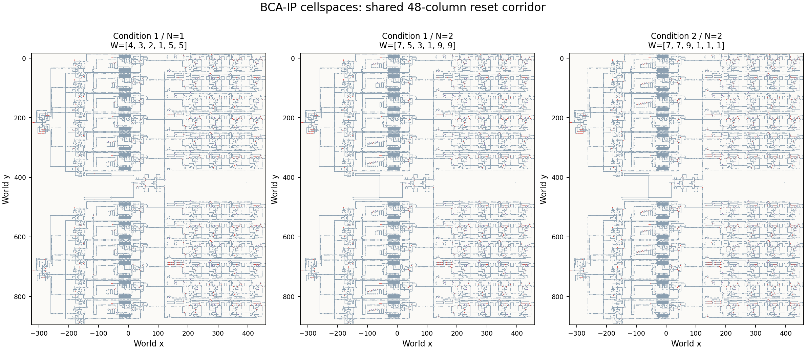
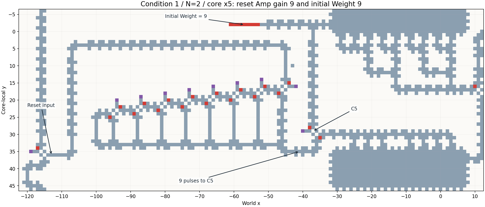

# BCA-IP：条件1・条件2のN比較用セル空間

minami指定の3条件。Nは論文の `W_i = N(c_max - c_i) + 1` の係数で、試行数ではない。

| ファイル | b | c | N | 初期Weight・reset用Simple Amp倍率（x1〜x6） |
| --- | --- | --- | --- | --- |
| [BCA-IP_condition1_N1.yaml](BCA-IP_condition1_N1.yaml) | 6 | [2,3,4,5,1,1] | 1 | [4,3,2,1,5,5] |
| [BCA-IP_condition1_N2.yaml](BCA-IP_condition1_N2.yaml) | 6 | [2,3,4,5,1,1] | 2 | [7,5,3,1,9,9] |
| [BCA-IP_condition2_N2.yaml](BCA-IP_condition2_N2.yaml) | 8 | [2,2,1,5,5,5] | 2 | [7,7,9,1,1,1] |

aはいずれも `[1,1,2,2,4,4]`。解の読み出しにはそれぞれ [condition1.json](condition1.json)、[condition2.json](condition2.json) を渡す。全64候補の列挙による最適値はいずれも14で、最適解は条件1が `111100`、条件2が `110101` / `110110`。

## 実行時の組合せ

**このディレクトリのセル空間には、必ず [BCA-IP_wide_events.py](BCA-IP_wide_events.py) を使う。** 遷移規則は既存の `Sample/rule/base-rule.yaml`、`global_prob=0.5`。リポジトリのルートから、例えば条件1・N=2の動作確認は次のように実行する。

```sh
python scripts/run_bca_ip.py \
  --cellspace Sample/Cellspace/BCA-IP-variants/BCA-IP_condition1_N2.yaml \
  --events Sample/Cellspace/BCA-IP-variants/BCA-IP_wide_events.py \
  --rules Sample/rule/base-rule.yaml \
  --label condition1-N2-wide \
  --output-dir results/condition1-N2-pilot \
  --steps 100000 --trials 8 --device cuda --mode cuda \
  --rng independent --global-prob 0.5 --seed 20261006
```

これは実行例であり、この作業で長時間のGPU統計ジョブは投入していない。

## 配置と元データ

- 最大9倍のreset用Ampを配置するため、x=-65の手前へ48列を追加した。TD側の座標は48セル左へ移動する。TD観測点はx=-135、reset注入はx=-116となる。FSM・目的値Ampの出力観測点とy座標は維持した。
- **3条件とも同じ拡張とreset入力配線を使う。** 条件1のN=1とN=2の差は初期Weightとreset用Ampの内部だけ。条件間では原稿の問題設定に伴う目的値AmpとTD抵抗の違いも保持する。
- 元の `Sample/Cellspace/BCA-IP.yaml` は変更していない。以前の512試行と今回のファイルは配置が異なるため、CAステップ数を同一配置でのN比較として直接混ぜない。
- 新しい初期状態から実行する。以前のセル空間のcheckpointをこの配置へresumeしない。
- 条件1は論文作成時の `R6/MapEditer/BCA-IP.yaml` を、既存ファイルとの差分232セルで復元した。[source patch](condition1-source-patch.json) に変更前後の値と両原本のSHA-256を記録した。条件2は既存ファイルを基にした。
- [manifest.json](manifest.json) に係数・Weight・reset倍率・座標範囲・ファイルハッシュを保存した。条件1は911×781セル、条件2は911×783セル。

## 検証の範囲

- [validation.json](validation.json)：A/B両側のWeight数・b入力数、イベント座標、変更範囲、同倍率回路の一致を検査。生成したYAMLから切り出した全7倍率（1,2,3,4,5,7,9）に対する、3独立試行×3入力と無入力対照の実測も記録する。
- [weight-reset-validation.json](weight-reset-validation.json)：実際のC5とPost Poolへ接続し、WeightをPre Pool入口まで返す試験。各倍率で2独立試行×2回のresetと、同数のWeightを入れた無reset対照を使う。Post PoolからC5入力の待機経路まで残量の計測対象に含める。
- [smoke-validation.json](smoke-validation.json)：3つの統合ファイルを対応イベントとともに読み込み、独立乱数・CPUで128更新し、配線とRecycle Binの位置が保存されることを確認する短い試験。
- **全FSMのKey/Ans/TD復帰と、長時間の最適解探索性能は別途pilotが必要。** 単体試験の出力端は吸収境界であり、統合回路の混雑・連続reset時の全挙動を保証しない。

再生成・再検証：

```sh
python scripts/generate_bca_ip_cellspaces.py
python scripts/validate_bca_ip_cellspaces.py
python scripts/validate_bca_ip_weight_reset.py
python scripts/smoke_bca_ip_cellspaces.py
python -m pytest tests/test_cellspace_variants.py -q
```

## 既存の条件2・N=1について見つかった不整合

既存ファイルの初期Weightは `[4,4,5,1,1,1]` だが、reset用Ampの段数は条件1用の `[4,3,2,1,5,5]` に対応していた。今回の3ファイルは初期Weightとreset倍率を一致させている。

これは以前の512試行の非到達原因を確定するものではない。ただし、既存データを「reset倍率も整合した条件2・N=1」の対照として扱うことはできない。条件2でNの効果を比較する際は、今回と同じ配置・reset設定にそろえたN=1対照も用意する。

## 配置の確認図




