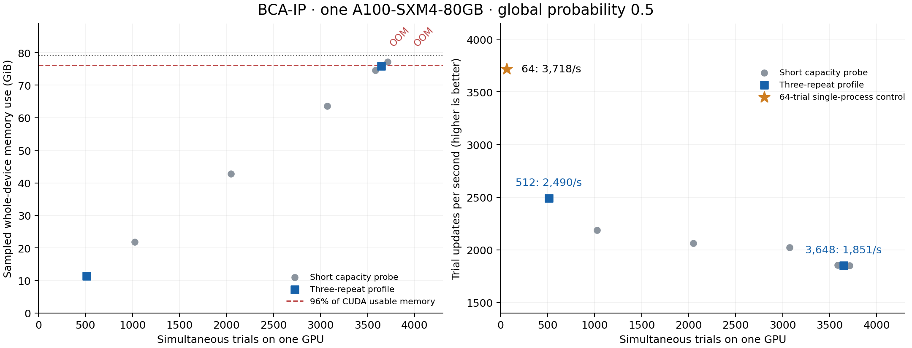

# A100 80GB: BCA-IP throughput and memory-capacity benchmark

## Results

Completed on 2026-09-25 02:14:38 JST. On **one** A100-SXM4-80GB with
`global_prob=0.5`:

| Simultaneous trials | Whole-device peak (GiB) | Trial updates/s | Estimated hours for 3,000,000 updates/trial |
|---:|---:|---:|---:|
| 512, one process | 11.367 | 2,489.95 | 171.41 |
| 3,648, two processes on the same GPU | 75.912 (95.79%) | 1,851.26 | 1,642.32 |

The 64-trial control achieved 3,718.01 trial updates/s (14.345 hours of updates
per target batch). Filling VRAM does not maximize throughput for this core.
All durations above are projections from short benchmarks, not completed
3,000,000-update statistical trials. The near-capacity protocol and its history
I/O limitation are detailed below. No Kyoto production statistical job was
submitted as part of this benchmark.



## Scope and environment

The user requested a Kyoto benchmark in parallel with the existing rokko work:
512 simultaneous trials on one A100 80GB, then a cohort close to the GPU memory
capacity, reporting throughput and estimated duration for 3,000,000 CA updates
per trial. These are performance measurements, not additional optimization
statistics or a completed 3,000,000-update experiment.

- Host alias: `gardenia`, account `b39859`.
- Dedicated deployment: `/home/b/b39859/PyBCA_workspace/bca-ip-a100-20260925`.
- Scheduler: Kyoto Slurm, partition `pg`, `--rsc g=1` (one allocated GPU).
- Device observed in job 298047: NVIDIA A100-SXM4-80GB, compute capability 8.0,
  CUDA-reported memory 85,093,777,408 bytes; MIG disabled.
- Runtime: Python 3.11.13, PyTorch 2.2.0+cu121, NumPy 1.26.3, nvcc 12.1.105.
- Modules match the user's existing script: `SysG/2022`, `PrgEnvNvidia/2023`,
  `cuda/12.1.1`, `pytorch/2.2.0.py311_cuda-12.1`.
- Base snapshot: `7fa4014a270d0fc934e0bcd21faad290c33f85d3`; core/api match
  the implementation audited on V100. Benchmark drivers and a test-fixture
  compatibility fix are overlaid; simulation core and inputs are unchanged.

## Validation before timing

Job 298047 completed the full audit of all 76 rule entries, all 5,776 ordered
rule pairs and 837,520 placements, including 171,952 outer-conflict rejections.
All audit sections passed in 223.89 seconds. Two following unit tests failed
because PyTorch 2.2 cannot pickle `torch.Generator` during `deepcopy`; these
failures occurred in the test fixture, before comparing simulation states.

`tests/test_core_runtime.py` now copies generator states explicitly into
independent generators, without changing the simulation implementation. The
CPU suite passed (20 tests, with 3 CUDA-only cases skipped locally), and the
A100 rerun passed all 20 tests without skips. A new test confirms that advancing
the copied generator does not modify the source stream.

Job 298048 resumes with the fixed unit tests and a 100,000-update full BCA-IP
replay: seed 20260924, trial IDs 0 and 1, `global_prob=0.5`, `cuda/independent`.
`scripts/validate_device_replay.py` compares every final cell, the rule
probabilities, input/implementation identity and every committed event with
the archived V100 run. All checks passed: every cell and all 242 events match
exactly, despite PyTorch/CUDA versions differing between the two machines.
The common final-cell SHA-256 is
`5124b8ed4d6dd925e2eca0e53b586f153b7d4fe0b4d2f40167208a22b020d28d`.
Job 298049 started on ng0008 at 2026-09-25 01:29:06 JST after this success.

Evidence is saved in [the A100 benchmark artifact directory](../benchmarks/2026-09-25-a100/):
`all-rules.json`, `environment.json`, `device-parity.json`, `validation-console.txt` and
the submission records. GPU tests had no skips.

## Measurement method

`scripts/benchmark_bca_ip_gpu.py` first measures 512 trials in one process:
1,000 warmup updates, then three repetitions of 1,000 updates. It then brackets
and bisects memory capacity in units of 64 trials. Short probes use 10 warmup
updates plus 64 measured updates and a full checkpoint. The largest fitting
cohort was initially planned for 100 warmup updates and three repetitions of
1,000 updates. After the 512-trial profile took about 206 seconds per repeat,
the near-capacity protocol was changed to three repeats of about 200 seconds
each, retaining 100 warmup updates. The step count is fixed before timing,
rounded up from the short probe's update time. This gives comparable observation
time instead of spending much longer on the slowest cohort.

`scripts/profile_bca_ip_capacity.py` performs this continuation in a separate
job after the complete memory search has been saved. It verifies the GPU model,
total memory and every source/input SHA-256 in the original plan. The original
benchmark driver and simulation core remain unchanged. The source plan's hash
and continuation driver's hash are recorded with the new measurements. If the
longer profile exceeds the memory budget, the cohort is reduced and measured
again. The interrupted original near-capacity profile is not used as a result.

For the selected 3,648-trial cohort, the resulting protocol is 100 warmup
updates and 3 × 102 timed updates (406 total). This is below the 1,000-update
automatic history-flush interval: events are buffered during these timing
windows and flushed by the separately measured final checkpoint. The
near-capacity projection therefore does not directly sample intermediate
history-only flushes of a long run. The 512-trial profile does cross the
automatic flush boundaries. This distinction and later-state workload changes
remain limitations of the long-horizon extrapolation.

An independent control job uses the existing `scripts/benchmark_core.py` in a
single process, without the capacity coordinator: 64 trials with 1,000 updates
per repeat and 512 trials with 200, each repeated three times after 10 warmup
updates. These controls use the same probability and seed, but earlier and
different-length trajectory windows; they are labelled separately.

All cases use the current BCA-IP cell space, all 44 events, `global_prob=0.5`,
seed 2026092501, independent Philox streams, candidate capacity 4096 and an
event flush every 1,000 updates. This benchmark seed differs from the
statistical experiment. Checkpoints are timed on the actual output filesystem,
including GPU-to-host transfer and fsync. Temporary benchmark histories and
large checkpoints are removed after each probe; measurements, identities,
memory samples and worker logs remain.

The current CUDA wrapper restricts a single process to 3,207 trials for this
911×735 grid because `trials * cells_per_trial` must be below 2^31. The TNHW
matching-mask addressing is already 64 bit; the separate lattice offsets
still have the smaller bound. To fill more of an 80GB GPU without modifying
the validated core, larger cohorts use two processes on the **same GPU**, each
below the native bound. Global trial IDs are disjoint, contiguous partitions.
No NVIDIA MPS is enabled by the scripts.

Both processes must finish allocation before warmup starts, and both remain
resident until the checkpoint phase finishes. Each timed repetition starts
from a common coordinator signal and ends after the last worker synchronizes
and writes its completion record. Throughput uses the total cohort size
divided by that shared elapsed time; it does not add independently timed
worker rates. Checkpoint timing likewise spans all workers together.

The memory budget is 96% of CUDA-reported total memory, including all resident
contexts and the coordinator. Device usage is sampled every 0.5 seconds;
per-worker peak allocated/reserved memory is recorded separately. The sampled
device peak is not a guarantee of capturing every instantaneous allocation.
Allocation failures terminate the remaining workers, release their contexts
and reduce the next candidate. Non-OOM errors abort the benchmark rather than
being treated as evidence of insufficient VRAM.

## Runtime estimates

For median measured cohort-update time `s`, measured cohort checkpoint time
`c`, setup time `u` and target `H=3,000,000`:

```text
trial updates / second = simultaneous_trials / s
checkpoint writes = floor(H / 10,000) + 2
nominal elapsed = u + H*s + checkpoint_writes*c
conservative elapsed = u + 1.10*(H*slowest_repeat + checkpoint_writes*c)
```

The checkpoint count includes initial and final saves, including the extra
final save when the target coincides with a periodic checkpoint. The 10%
margin is an explicit planning assumption, not a confidence interval. Initial
warmup time is not added again, because those updates are part of the target
trajectory in a real run.

A full GPU memory allocation need not increase aggregate throughput or reduce
the time per trial. Report the 512-trial profile and the near-capacity profile
separately, with the short capacity probes clearly identified. Long-horizon
runtime is an extrapolation from the measured segments; later circuit states,
candidate overflows, clock changes and growing manifest I/O can change it.

## Completed baseline and capacity search

The 512-trial profile measured 205.711, 205.626 and 205.607 milliseconds per
cohort update, or **2,489.95 trial updates/second** at the median. Its projected
3,000,000-update duration is **171.41 hours**, including 302 checkpoint writes
at the measured 0.645 seconds per save. The conservative projection is 188.63
hours. This is already longer than seven days; a long production run needs a
checkpoint/restart schedule rather than assuming it fits in one allocation.

The independent single-process 512-trial control measured 2,484.22 trial
updates/second, only 0.23% lower. It ran on ng0002; the primary baseline and
capacity search ran on ng0008. The agreement does not indicate material
slowdown from the capacity coordinator.

The same control at **64 trials** measured **3,718.01 trial updates/second**,
with median 17.214 milliseconds per cohort update. Its update-only projection
is **14.345 hours** per 3,000,000-update batch. The control checkpoint used the
temporary filesystem, so it is not used to certify production-filesystem
checkpoint time. Eight consecutive 64-trial batches would require about
114.76 hours of updates for 512 trials, assuming the observed rate persists.
That is an extrapolation, not a completed eight-batch experiment.

The capacity search in 64-trial increments found:

| Trials on one GPU | Sampled device usage (GiB) | CUDA usable memory | Outcome |
|---:|---:|---:|---|
| 512 | 11.367 | 14.34% | 3 × 1,000-update profile passed |
| 3,584 | 74.608 | 94.14% | Short probe and checkpoint passed |
| 3,648 | 75.912 | 95.79% | Largest short probe within the 96% budget |
| 3,712 | 77.213 | 97.43% | Ran and saved, but exceeds the 96% budget |
| 3,840 | — | — | CUDA out of memory |
| 4,096 | — | — | CUDA out of memory |

The 96% choice is a headroom policy, not a claim that 3,648 is the absolute
physical allocation limit. Successful short probes use only 74 total updates
(10 warmup plus 64 timed); their throughput is not substituted for the longer
near-capacity profile. All successful probes observed zero candidate overflow
rows at their final sample; overflow was not monitored at every update.

Of the baseline's 10.46 GiB allocated to tensors, the dense
`trials × 28 rules × 911 × 735` Boolean match mask alone occupies 8.94 GiB
(85.48%). Allocating more VRAM mainly enlarges this structure. The initial
cell space contains 555,833 zero cells out of 669,585; four rules have a zero
center, so those cells cannot simply be omitted without preserving the full
matching semantics. See `memory-structure.json` for the exact counts.

## Near-capacity profile and bottleneck

Job 298054 completed three 102-update repetitions after 100 warmup updates.
The shared elapsed times per update were 1.970528, 1.970552 and 1.970805
seconds, including both workers. The median aggregate throughput is
**1,851.26 trial updates/s**. Both workers completed 406 updates, and their
combined full checkpoint/flush took **2.269 seconds**. The sampled device
peak remained **81,510,268,928 bytes (75.912 GiB, 95.79%)**, within budget.
Both final overflow-row counts were zero.

The nominal 3,000,000-update projection is **1,642.32 hours (68.43 days)**.
Using the slowest repeat plus the stated 10% planning allowance gives
**1,806.78 hours**. This allowance is not a confidence interval or a guarantee
that later circuit states stay within that bound. The result demonstrates a
memory capacity, not an efficient production batch size.

After the cohort profile, `scripts/profile_cuda_stages.py` measured 50
instrumented updates after 10 warmup updates at each of 64 and 512 trials.
The simulation kernels were unchanged; CUDA events bracketed their existing
launch groups. Compound groups include any gaps between their kernels.

| Trials | Match / probability gate / candidate packing (ms) | Rule ordering / conflicts / writes (ms) | Special events (ms) |
|---:|---:|---:|---:|
| 64 | 16.420 | 0.511 | 0.013 |
| 512 | 203.550 | 1.148 | 0.015 |

At 512 trials the matching stage accounts for **99.43% of the sum of the
measured stage medians**. These diagnostic spans are not substituted for the
uninstrumented throughput measurements. They identify `match_kernel` as the
next optimization target; the current stage scans every trial/rule/cell
combination. Any replacement must still determine matches from the original
step snapshot, retain per-trial RNG decisions and preserve conflict/application
semantics. The present benchmark does not modify that core.

## Jobs and artifacts

- `298047`: full rule audit passed; following legacy test-copy operations failed.
- `298048`: corrected runtime tests and cross-device replay passed.
- `298049`: baseline and full capacity search completed; cancelled at
  01:56:52 JST to replace the partial near-capacity profile with equal-duration
  repeats. The original plan is preserved as `capacity-search.json.gz`.
- `298052`: independent 64/512-trial single-process timing control passed;
  initially queued by the account's `MaxCpuPerAccount` limit.
- `298054`: near-capacity continuation, dependency `afterok:298052`, started
  on ng0008 at 02:00:22 JST and completed at 02:14:38 JST, exit 0.
  Its source plan is SHA-256 verified. All Kyoto benchmark jobs are finished.

Remote measurements are saved incrementally to
`results/a100-benchmark-298049/plan.json`, per-cohort `result.json`, and
`results/logs/a100-benchmark-298049.log`. Validation is saved under
`results/preflight-298047/` and `results/preflight-298048/`.

Final measurements reside in
`results/a100-capacity-profile-298054/plan.json` and `cuda-stages.json`;
controls are in `results/a100-control-298052/`. Locally, the artifact directory
contains both complete plans as compressed JSON, the concise `summary.json`,
raw control and CUDA-stage JSON, all validation/console logs, submission
records, and final `slurm-accounting.txt`. `plot_results.py` verifies the link
between the capacity search and continuation and regenerates the summary,
PNG and PDF figures. SHA-256 checksums accompany the archived artifacts.

The benchmark harness's CPU tests verify exact, nonoverlapping trial
partitions within the native indexing bound, runtime accounting using cohort
timing and all checkpoint writes, and rejection of a continuation with changed
inputs or an unfinished capacity search. The existing user changes in
`src/PyBCA/analysis/plots.py` are outside this benchmark work.
