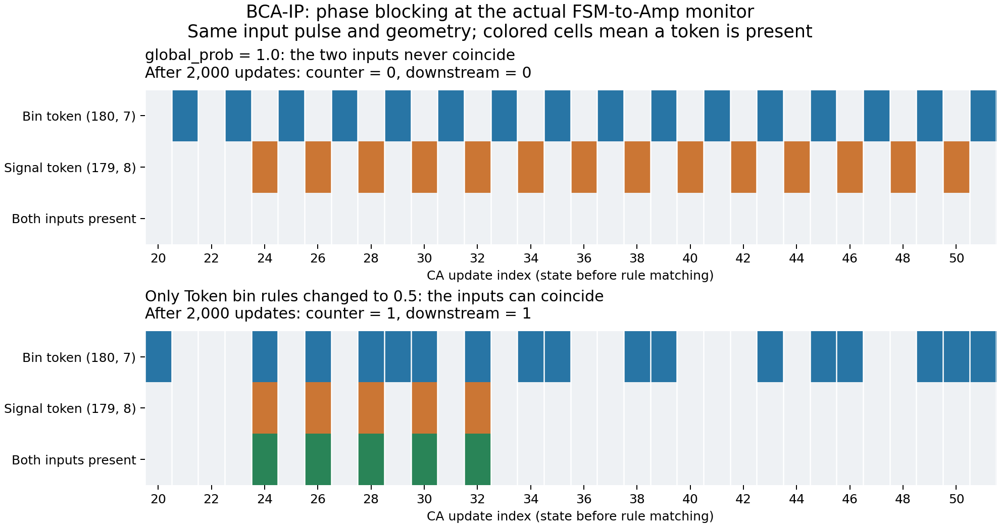

# global_prob=1.0での出力停滞と、FSM/Ampイベントの検証

2026-09-25。対象は現行 `BCA-IP.yaml`、`base-rule.yaml`、`BCA-IP_event.py`。参照原稿はユーザー指定 `BCA-IP_2026-09-17/revised/`。本番の回路・遷移規則・イベント・チェックポイントは変更していない。

## 結論

**実際のセル空間から切り出した観測回路で、global_prob=1.0によるCJoinの位相不一致と、本線の通過停止を再現した。イベントの条件判定や履歴保存の不具合は今回の検査では見つからなかった。**

Token binは、接続先が空ならトークンを作り、トークンがあれば回収する。両遷移が確率1で毎更新適用されると、他の相互作用がない間は `1→2→1→2` の2更新周期になる。一方、CJoinは本線の信号とToken binからのトークンが同時に入力へ来る必要がある。実回路では、この二つが逆の位相で繰り返し到着する入力条件があり、CJoinの前条件が一度も成立しなかった。

この観測用CJoinは本線の通過にも必要である。したがって、この詰まりではカウンタだけが0になるのではなく、**下流に送る信号も0になる**。TD→FSMの観測部で詰まるとFSMへ入力が届かず、FSM→AmpやAmp出力の観測部でも同じ問題が起こる。

Token binの8規則だけを確率0.5にする対照では、他の遷移を1.0のままにしても通過が回復した。イベント定義と検出確率は変えていない。この介入により、少なくとも切り出した回路における停滞を、供給・回収のタイミングとCJoinの入力同期に結び付けられる。

これは旧1.0の512試行すべてについて停止箇所を完全に追跡した証明ではない。全体回路の長い観測期間での出力0と整合する局所機構を、実回路・対照実験・旧CPU適用アルゴリズムで確認した結果である。

## 論文との対応

- 本文 `v3_main/02_preliminaries.tex:136` はBCAを **asynchronous cellular automaton** と説明する。
- 同 `:155-160` はToken binからの供給・回収と、信号線を通過するトークンにbinのトークンをCJoinで組み合わせて、通過を数える構造を説明する。論文のbin状態3はコードでは-1に対応する。
- 本文 `v3_main/05_bca_ip_verification.tex:90,172` の `x1output`〜`x6output` はFSM-core出力＝Controllable Amp入力、`Amp x1output`〜`Amp x6output` はAmp出力である。現行24出力イベントの役割と一致する。
- SI `v3_SI/02_internal_design.tex:43,50,56,93,114` と `figs/Noise-yokusei-FSM.drawio.pdf` はKey Token・Ans Token Loop・Weight Pool・binにつながるCJoinの構造を示す。FSMの出力初出には一時的なノイズが含まれうるため、最適解到達判定とは分ける。

`global_prob`はイベントを記録する確率ではなく、**CAの遷移候補を採用する確率**。今回の44イベントは6列の定義で、追加のイベント確率は省略時の1.0、時刻制限はなし。規則の候補は更新前の共通状態から一括で照合されるため、規則の訪問順をシャッフルするだけでは、既に逆位相になったCJoinの前条件を同じ更新内で作り直せない。

この実装の1.0は、非同期BCAの単なる高速版として扱えない。0.5と1.0では独立な待ち時間の有無が変わり、回路の通過性も変わる。ただし、原稿に0.5という数値が明記されていたという主張はしない。

## 実回路を使った入力時刻の対照実験

原型の全規則を使用し、セル空間から次の4種類を切り出した。原型の2→1カウンタに加え、境界から外へ出る信号を回収する診断用sinkを下流へ置いた。各設定で「入力なし」1ケースと、入力時刻を0..7更新へずらした単一トークン8ケースを各2,000更新実行した。縮小格子なので、元の512試行の軌道を再現した実験ではない。

| レイアウト | 本物の検出座標 | 対応するイベント数 |
| --- | --- | ---: |
| TD→FSM | A1: (-87,11) | A/Bの1..6、12個 |
| FSM→Amp、x1型 | A1: (187,9) | A/Bのx1、2個 |
| FSM→Amp、x2..6型 | A2: (187,75) | A/Bのx2..6、10個 |
| Amp出力 | A1: (137,35) | A/Bの1..6、12個 |

36箇所について、平行移動した初期格子の全セルとイベント座標を照合した。FSM x1型とx2..6型は下流の1セルが異なるため、別のレイアウトとして両方検査した。

**次の結果は4種類すべてで一致し、CPU reference/legacyとCPU torch_sparse/independentの両方で再現した。**

| CAの条件 | 8入力のうちカウンタと下流の両方へ1個到達 | 2,000更新で両方0 |
| --- | ---: | ---: |
| global=1.0、全規則=1.0 | 4（入力時刻1,3,5,7） | 4（0,2,4,6） |
| global=1.0、bin規則のみ0.5 | 8 | 0 |
| global=0.5、全規則=1.0 | 8 | 0 |

入力なしでは全レイアウト・設定・実装でカウンタも下流も0。通過したケースは両側とも1件で、本線を数える代わりに消していたという挙動ではなかった。この4/8は診断で選んだ8入力時刻の結果であり、BCA-IPの最適化失敗率ではない。

CPU torch_sparse/independentでのFSM x1型の例では、CJoin中心(180,8)の北入力(180,7)がbin側、西入力(179,8)が信号側。global=1.0・時刻0入力では2,000更新の事前状態が次の内訳となった。

| CJoinの北・西入力 | 回数 |
| --- | ---: |
| 両方なし | 12 |
| bin側のみ | 1,000 |
| 信号側のみ | 988 |
| 両方あり | **0** |

規則を適用する以前にCJoinの必要条件が成立していない。reference/legacyでは両方なし5回、bin側のみ1,000回、信号側のみ995回で、同様に両方ありは0回だった。乱数方式が異なるため移動開始までの軌道は一致しない。bin規則だけ0.5にすると両入力が揃い、同じ信号がカウンタと下流の両方へ到達した。



実測JSON: [independent.json](independent.json)、[reference.json](reference.json)。再現コード: [audit_bca_ip_monitors.py](../../../scripts/audit_bca_ip_monitors.py)。

```sh
PYTHONPATH=src python scripts/audit_bca_ip_monitors.py --mode torch_sparse --output /tmp/monitor-independent.json
PYTHONPATH=src python scripts/audit_bca_ip_monitors.py --mode reference --output /tmp/monitor-reference.json
```

## イベント処理そのものの検査

44イベントには共有する参照点が2組あり、参照座標は42個。次の44ケースを各実装で実行し、**全格子の書込み結果とイベント名・記録時刻を独立に計算した期待値と照合**した。

- 不発条件1ケース。
- 各参照点だけを2にする42ケース。Resetのset/clearは同じ参照点なので両方発火する必要がある。
- 全参照点を同時に2にする1ケース。

reference/legacyの44ケース、torch_sparse/independentの44ケースとも不一致0。記録時刻は123を指定して確認した。各参照点の座標変換、2→1の書込み、Resetの2書込みを共通の事前条件から評価する処理を検査している。

また旧1.0のrank 0・trial ID 1・更新1,142,419の保存状態から、全格子をCPUで100更新追跡した。イベント直前の44セルから計算した発火予測と記録の不一致は0。A4のFSM出力本線にトークンはなく、その近傍のCJoinも発火しなかった。一方、同じ最初の更新の全格子ではCJoin規則8が6箇所で前条件を満たし、6箇所とも採用されている。したがって、CJoin実装全体が無効化されているわけではない。

この追跡は保存状態のコピーを使った診断で、本番を再開・変更したものではない。[保存状態の追跡](checkpoint-trace.json)、[最初の更新の候補・採用数](candidate-conflicts.json)。1.0と0.5の保存データ比較は[前回の診断](../2026-09-25-probability-check/report.md)を参照。

今回の位相試験はCPUで行った。GPUでは先行のV100試験で全遷移規則・適用アルゴリズムと既存44イベントの強制発火を検査済みで、今回検査したローカルのcore/api全20ファイルが、その後に行ったV100上の0.5診断時のハッシュと一致することを確認した。今回新たにV100上で位相試験を実施したとは報告しない。

## 統計実験への扱い

本番は投入済みのglobal_prob=0.5を維持する。bin規則だけ0.5という条件は原因を切り分ける診断用であり、本番条件へ混ぜない。イベント0件を「平均到達時間が非常に長い」「最適解発見失敗」と直ちに数えず、回路が信号を通せる条件かを先に検査する。最適解の状態判定器の確定は別に必要である。
