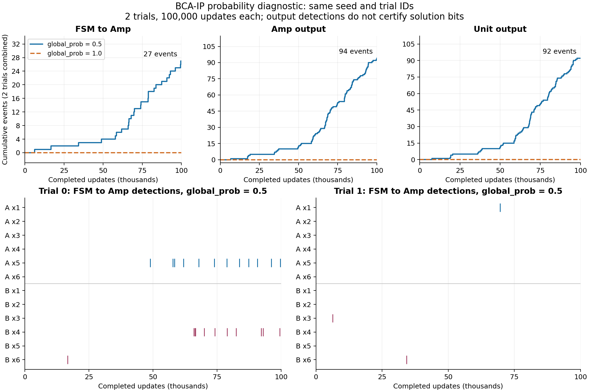

# BCA-IP: FSM→Amp出力、確率設定、論文との照合

2026-09-25 JST。参照原稿はユーザー指定の `BCA-IP_2026-09-17/revised/`。本文・SIのTeXと回路図を確認した。参照ファイルのSHA-256、入力トークンの全座標、問題の全列挙結果は [cellspace-inputs.json](cellspace-inputs.json) に記録している。

## 結論

- `global_prob=0.5` の2試行・100,000更新では、FSM→Amp出力27件、Amp出力94件、Unit出力92件を検出した。同じseed・試行ID・100,000更新の `global_prob=1.0` はいずれも0件だった。
- 原稿の `x1output`〜`x6output` はControllable Ampへの入力、すなわちFSM-core出力であり、現行イベントもその観測点に対応する。出力0件は最適解判定イベントだけを数えていたためではない。
- 現行セル空間のA/B両Unitの初期入力は **b=8、W=[4,4,5,1,1,1]**。SI Instance 2と一致し、本文Instance 1の入力とは一致しない。閾値回路によるaとAmpのControl設定の独立検証は未完了で、完全なインスタンス認定はまだ行っていない。
- `global_prob=1.0` を論文条件と確認せず既定値で使用したことが実験設定上の問題だった。原稿内に数値 `global_prob=0.5` の明記は確認できていない。0.5の出典はユーザーの「おそらく0.5」という回答であり、今回の診断はそれで回路の出力が生じることを実証したもの。
- この2試行は動作診断であり、最適解到達時間・失敗率の統計標本には追加しない。512試行の新ジョブは同じseed・試行IDを初期状態から実行する。旧1.0の途中状態から確率だけを変えて再開しない。

## 同条件の確率比較

V100、`cuda` / `independent`、seed `20260924`、global trial IDs `0,1`、各100,000更新。セル空間・規則・イベントと全20個のcore/api実装ファイルのSHA-256が一致することを検査した。0.5は2試行の診断実行、1.0は64試行rankのうち同じ2試行を抽出したもの。独立乱数の試行分割不変性は既存のCPU/V100テストで検証済み。

| 観測 | global_prob=1.0 | global_prob=0.5 |
| --- | ---: | ---: |
| TD→FSM入力 | 4 | 29 |
| FSM→Amp (`A_x*output`, `B_x*output`) | 0 | 27 |
| Amp出力 (`*_Amp_x*output`) | 0 | 94 |
| Unit出力 (`F_value_A/B`) | 0 | 92 |
| Comparator出力 | 0 | 0 |
| Resetイベント | 0 | 0 |

初めてのFSM→Amp出力はtrial 1の `B_x3output`、ログのstep=6,329、完了更新回数では **6,330**。その後 `B_Amp_x3output` は6,624更新、`F_value_B` は7,594更新で初検出。全3,000,000更新のComparator/Reset動作まで確認できたという意味ではない。

図の横軸は完了更新回数、下段の縦線はFSM→Ampの各出力検出。0.5のUnit出力92件とAmp出力94件の差はこの有限観測期間での値であり、各イベントを個別に保存している。目的関数の値をこの総イベント数から直接読み取らない。

診断は旧PBSジョブの割当内に `pbs_attach` で参加させて実施し、追加の割当外GPUは使用していない。100,000更新を229.48秒で完了し、終了コード0、`stopped=false`。同じGPU上の旧実行と資源を共有した2試行なので、この所要時間を64 trials/GPUの本番性能予測には使わない。

`global_prob=1.0` では各候補のBernoulli棄却がなく、乱数による規則順序は同じ試行の空間全体で共通になる。旧実行では同じ添字のA/B入力イベントの時刻・回数が一致していた。対称部分の同期が続くことは出力停滞の原因候補だが、これだけで全状態の不動化や永久停止を証明したとはしない。

## 観測点と原稿

- 本文 `v3_main/05_bca_ip_verification.tex:90` はFSM-core出力をControllable Ampsへ入る線と明記し、`:172` は `x1output--x6output` をAmp入力、`Amp x1output--Amp x6output` をAmp出力としている。
- SI `v3_SI/02_internal_design.tex:31,43,50,56` はWeight Pre Pool、Key Token、Ans Token Loopの関係を説明している。Pre Poolが空になり、Distributed TokenがAns Loopから戻れなくなる状態と出力を対応させる。
- 同SI `:93,114` にはPre Poolが空になる前にも出力ノイズが生じ、抵抗で抑える設計であることが書かれている。したがって **各出力の初出をxi=1の確定や最適解の初到達と同一視しない**。
- 本文 `:178` は×3/×4 Ampが安定せず目的関数比較を歪めうる点を明記している。最適な実行可能解の発見、Ampの数値表現、Comparatorによる選択は別々に検証する必要がある。
- 図 `figs/FSM-core.drawio.pdf`、`FSM-TD.drawio.pdf`、`Map_CTT_TD.drawio.pdf`、`Map_A_unit_BCA-IP.drawio.pdf` を描画して接続を確認した。

現行イベント座標（セル空間の元座標、i=1..6）は次のとおり。全44イベントの参照点・書込点が格子内の有効なwireであることも検査した。

| 観測 | Unit A | Unit B |
| --- | --- | --- |
| TD→FSM | (-87, 11+66(i-1)) | (-87, 506+66(i-1)) |
| FSM→Amp | (187, 9+66(i-1)) | (187, 504+66(i-1)) |
| Amp出力 | (137, 35+66(i-1)) | (137, 530+66(i-1)) |
| Unit出力 | (120, 413) | (120, 427) |

## 現行セル空間の入力

本文 `v3_main/04_bca_ip_architecture.tex:130,140` の規定は `Wi=N(cmax-ci)+1` と、TDへ直接b個のトークンを与える方式。

現行YAMLのb入力はAの `y=217`、Bの `y=712`、`x=-275..-259` の線に各8個。Weight入力はAの `y=-2+66(i-1)`、Bはさらに495の平行移動にあり、初期トークン数は両側 `[4,4,5,1,1,1]`。全座標をJSONに保存した。

| 原稿の条件 | b | c | N=1のWeights | 最適解（全64通り列挙） |
| --- | ---: | --- | --- | --- |
| 本文Instance 1 | 6 | [2,3,4,5,1,1] | [4,3,2,1,5,5] | [1,1,1,1,0,0]、値14 |
| SI Instance 2 | 8 | [2,2,1,5,5,5] | [4,4,5,1,1,1] | [1,1,0,1,0,1] / [1,1,0,1,1,0]、値14 |

両方とも原稿の `a=[1,1,2,2,4,4]` を使用した列挙。出典は本文 `v3_main/05_bca_ip_verification.tex:24-25`、SI `v3_SI/04_additional_simulation.tex:20-21`。SIの分配用抵抗はこのインスタンスに合わせて再調整されている（同SI `:11`）。bとWeightsが一致したことだけで、閾値・Amp制御・全抵抗値まで原稿と同一だとは認定しない。

## 保存データの検査と旧ジョブの停止

旧 `236862.rokko1` は2026-09-24 16:25:19開始、2026-09-25 00:30:28に明示的に停止。PBS終了値271はこの取り消しによるもの。8 rankすべてのrunnerは `stopped=true` を記録し、最終状態・履歴を保存した。

最終更新回数（rank 0..7）: `1142419, 1147426, 1147499, 1146020, 1149819, 1152302, 1146533, 1147403`。入力イベント合計868件、FSM/Amp/Unit/Comparator/Reset出力は全512試行で0件。300万更新に達していないため、旧実行を300万ステップでの失敗512件として数えない。

- 実行中00:17の検査では、512状態を読込、状態の静的なwire/bin/background区分の変化0、全試行IDが0..511に重複なく対応、512状態が互いに異なることを確認。
- 同検査の8,890履歴chunkのSHA-256・連続範囲・行数・イベント名・試行IDを確認した。GPU allocatedは各rank 1,404,225,536 bytesで検査期間中一定。
- 停止後、旧8 rankと診断1実行の全9チェックポイントをCPUで読み戻し、格子値・試行数・core/apiの全ソースハッシュ、checkpoint内manifestと外部manifestの完全一致を確認した。
- 全最終履歴も再検査。比較対象の入力と実装ハッシュ一致、chunk検査、重複・範囲検査はエラー0件。

証跡: [comparison.json](comparison.json)、[実行中検査](running-integrity-audit.json)、[停止後チェックポイント検査](stopped-checkpoints.json)。[audit.py](audit.py) はrokko上で同じ保存データを読み取り再検査するスクリプト。[plot_events.py](plot_events.py) は保存した比較JSONから図を再作成する。

これは実装・保存の整合性検査と出力経路の動作確認であり、統計実験の全条件や最適解判定の検証完了を意味しない。

## 再投入と残作業

`236962.rokko1` を2026-09-25 00:29:35 JST投入。`select=1:ngpus=8:ncpus=8:mpiprocs=8:mem=64gb`、`place=free`、24h、**64 trials/GPU × 8 = 512、3,000,000更新、global_prob=0.5を明示**。確率以外の入力・検証済みcore/apiは変更していない。旧ジョブの資源を解放した後、先行ジョブに割り当てられたため、新ジョブは資源待ち。00:48:59時点のPBS表示は `Q`、`ngpus (R:8 A:4 T:8)`。起動確認済みとはしない。[最新確認時の記録](queued-job.json)。

出力先は `results/bca-ip-512-trials-p05-20260925/`、ログは `results/logs/bca-ip-512-p05-236962.rokko1.log`。旧実行と診断のディレクトリは保持する。開始後は8 rank×64試行、全512ID、確率0.5、最初のcheckpoint、出力イベント、実測更新速度を確認する。0.5の64 trials/GPU性能はまだ測れておらず、1.0の約21時間という実測見積りを完走保証には用いない。

最適解到達の集計に残る作業:

1. 閾値回路のaとAmp Control設定を、原稿と現行セル空間の両方で確定する。
2. Pre Pool・Key Token・Ans Loopを読む判定、または原稿に対応する出力窓による判定を固定する。出力初出の単純ORは採用しない。A/Bの片方が最適な実行可能解を持った時刻と、比較器がそれを選んだ時刻は分ける。
3. 現行runnerは44イベント全履歴と最新の再開状態を保存する。過去の全Key Token状態は保存しないため、厳密な状態ベース初到達の測定には確定した判定器を付けた決定的な再実行が必要になる可能性がある。
4. 判定器を小規模試行で検証し、全試行の判定ハッシュを揃えて既存 `summarize_bca_ip_trials.py` に渡す。中断した未完了試行は失敗率の分母へ未到達失敗として混入させない。

現時点で最適解への平均到達ステップ・失敗率を得たとは報告しない。
