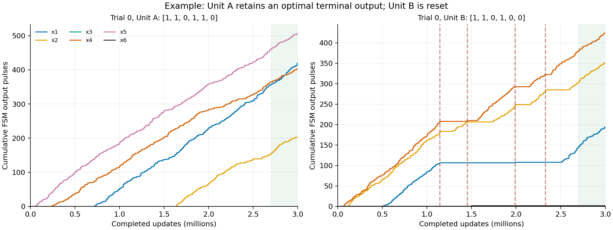
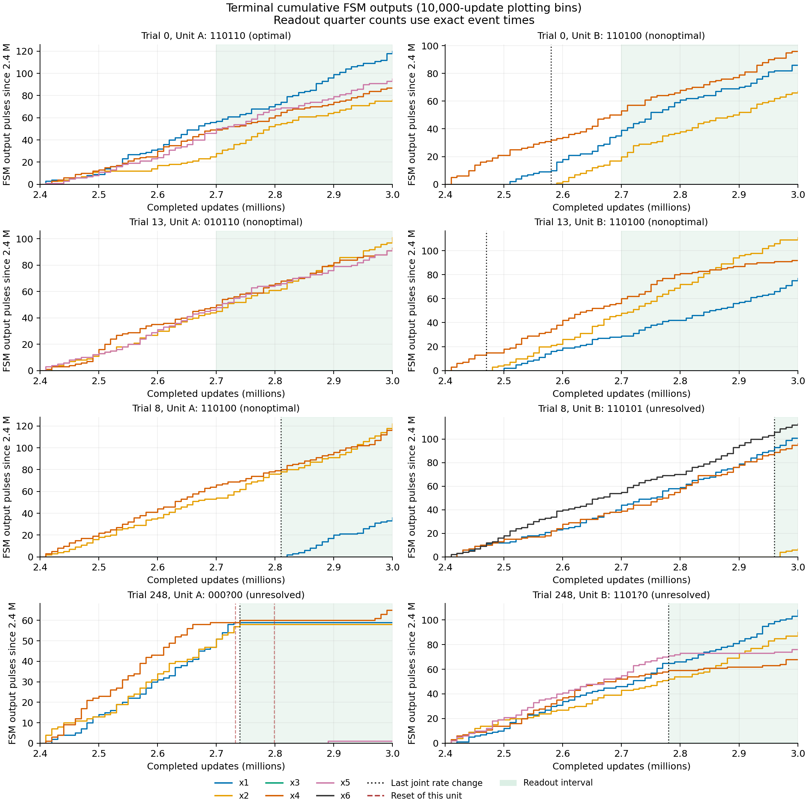

# 終了時の安定したFSM出力による最適解の集計

2026-09-28。rokko `236962.rokko1`、global_prob=0.5、512独立試行、各3,000,000更新の保存履歴を再集計した。ユーザー指定の「最後に流量が変わった後、継続的に信号が出ているFSM出力線を解と読む」という定義に基づく。

**主判定では423/512試行（82.617%）で、終了時点のA/Bの少なくとも一方に最適解の安定出力がある。**

追記：[継続時間を短縮した集計と未到達例の時系列解析](short-stability-and-nonhits.md)。最低4万更新では終端425試行、途中も含む到達430試行。この文書は前回の最低10万更新の基準を保存している。

| 終了時の読み出し | 試行数 | 全512試行に対する割合 |
| --- | ---: | ---: |
| 少なくとも一方が安定した最適解 | 423 | 82.617% |
| 両側とも安定した非最適解 | 63 | 12.305% |
| 安定区間が短い、または出力が間欠的で判定が揃わない | 26 | 5.078% |

最適解がA側のみ199試行、B側のみ209試行、両方15試行。A/Bを別試行として二重に数えない。89/512=17.383%は「主判定で最適解を確認しなかった割合」であり、26件の未確定も含むため、全89件を真の探索失敗とは呼ばない。63試行についても「終了時点で保持している解」の判定であり、過去に一度も最適解を出さなかったとする判定ではない。


## 対象の問題と信号

SI Instance 2、`a=[1,1,2,2,4,4]`、`b=8`、`c=[2,2,1,5,5,5]` に照合する。64個の二値ベクトルを全列挙し、制約 `a^T x <= 8` の下で最大値14、最適解は次の2個と確認した。

- `[1,1,0,1,0,1]`
- `[1,1,0,1,1,0]`

入力セル空間のb=8とWeights=[4,4,5,1,1,1]はこの設定に対応する。問題の出典は添付原稿 `revised/v3_SI/04_additional_simulation.tex:20-21`。読み出し対象は増幅前の `A_x1output`〜`A_x6output` と `B_x1output`〜`B_x6output`、合計1,363,691イベント。FSMの累積出力から変数を読む方法は本文 `v3_main/05_bca_ip_verification.tex:90`、SI同ファイル `:31` にも記載されている。

最適解との一致を見てビットを補完したり、不可能なベクトルを可能なベクトルに丸めたりしない。読み出し後に制約・目的関数を評価する。安定判定できた901 Unitの中に制約違反のベクトルはなかった。

## 読み出し条件

これらは今回の履歴解析で定めた事後的な観測条件であり、事前登録した条件ではない。全1024 Unitに同じ条件を適用した。

1. 各Unitの6本のイベント数を10,000更新ごとにまとめる。6本の流量を区分定数とするPoisson尤度型のモデルを、動的計画法で分割する。区間の最短長は30,000更新、追加区間のペナルティは20。最後の分割点を最後の流量変化とする。これは変化点の操作的な検出法であり、Brownian出力の間隔が厳密にPoisson分布に従うという主張ではない。
2. 最終区間が100,000更新以上継続していることを要求する。読み出し区間はその区間の終盤、最大300,000更新。以前の解やリセット前のパルスを全期間のORとして混ぜない。
3. 読み出し区間を時間で4等分する。各線が合計4イベント以上、かつ4区間中3区間以上で出力していれば1と読む。合計2イベント以下は0、それ以外は `null`（不明）。四分割の計数は10,000更新のビンを使い回さず、保存された正確なイベント時刻で行う。
4. 6ビット全てが判定でき、区間長の条件も満たす場合を安定した読み出しとする。片方だけでも最適解ならその試行を成功に数える。両側が安定し、両方とも非最適なら非最適。残りは未確定とする。

時間は完了したCA更新数で、raw履歴の `step + 1`。読み出し区間は `(開始, 終了]`。判定する線はFSM出力だけであり、RSMが来た側を自動的に0にしたり、反対側を自動的に最適としたりしない。RSMの時刻はグラフに併記する。

423成功試行の最適解Unitでは、0と読んだ線の実際のイベント数は全て0だった。0とする上限を2→1→0へ厳しくしても成功数423は変わらない。

## 時系列での確認例

trial 0はAが `[1,1,0,1,1,0]` を保持し、B側にはリセットが入る。これはユーザーの述べた「片方の解を保持し、もう片方を探索し直す」出力の例になっている。



以下は終盤600,000更新を拡大した図。赤破線はそのUnitへのreset、黒点線は検出した最後の流量変化、緑の背景は読み出し区間。図のみ10,000更新間隔で累積表示し、判定には元のイベント時刻を使用した。

- trial 0：片側で最適解を安定出力。
- trial 13：両側の安定した出力が非最適。
- trial 8：Bは最適解の6ビットに読めるが、最後の変化が2,960,000更新、観測長は40,000更新で、主判定の持続時間に届かない。
- trial 248：一部の線が間欠的で安定判定に届かない。



## 条件を変えた集計

他の条件は主判定のまま、表の条件だけを変更した。基準を緩めて最大の成功数を選ぶことはしていない。

| 変更 | 安定した最適解のある試行 | 割合 |
| --- | ---: | ---: |
| 主判定 | 423 | 82.617% |
| 読み出し区間の上限200,000更新 | 419 | 81.836% |
| 最後の流量変化後の全区間を読む | 422 | 82.422% |
| 最低持続時間50,000更新 | 424 | 82.813% |
| 最低持続時間150,000更新 | 420 | 82.031% |
| 最低持続時間200,000更新 | 415 | 81.055% |
| 変化点ペナルティ10（より細かく分割） | 411 | 80.273% |
| 変化点ペナルティ30（より粗く分割） | 425 | 83.008% |
| 出力が4区間全てに必要 | 410 | 80.078% |
| 0とする線はイベント0件のみ許容 | 423 | 82.617% |

検査した条件の範囲では410〜425/512（80.1〜83.0%）。主判定の423は観測条件を明示した集計値であり、条件に依存しない厳密な内部状態数とは区別する。終了時点に最適解を出す試行の割合としては約8割強で、全512試行が最適解に到達して保持したという結果ではない。

## 保存物と再現

- [fsm-readout-summary.json](fsm-readout-summary.json)：問題設定、判定条件、集計、感度分析、全trial ID、decoder SHA-256、各rank manifest SHA-256。
- [fsm-readout-trials.jsonl](fsm-readout-trials.jsonl)：全512試行のA/B各6ビット、目的値、制約値、流量変化時刻、読み出し区間、各線の四分割計数。
- [fsm-output-counts.npz](fsm-output-counts.npz)：図を再生成する10,000更新ごとの出力数とRSM時刻。
- [instance-2.json](instance-2.json)：全列挙に使った問題定義。
- [plot_fsm_readout.py](plot_fsm_readout.py)：上記の図を生成するコード。
- [fsm-readout-validation.json](fsm-readout-validation.json)：テストと実データの照合結果。

計算コードは `scripts/read_bca_ip_fsm_outputs.py`。既存の全24,000履歴chunkのハッシュ・行数・連続性を再検査して読み戻した。全1,363,691 FSMイベントは先のモジュール監査の合計とも一致し、最初の独立した抽出と全イベントの時刻・変数・試行IDが一致した。さらに終盤2,400 chunkをraw JSONから別に再計数し、全512試行×2 Unit×6線×4区間=24,576計数が完全一致した。解の切替をORしないこと、単発ノイズ、短い観測区間、制約違反を補正しないこと、時刻境界、A/Bの二重計数防止など9テストを通した。

```sh
OPENBLAS_NUM_THREADS=1 python3 scripts/read_bca_ip_fsm_outputs.py \
  results/production-p05-20260928/bca-ip-512-trials-p05-20260925 \
  --instance docs/experiments/2026-09-28-production-p05/instance-2.json \
  --output results/production-p05-20260928/fsm-readout

python3 -m unittest discover -s tests -p 'test_fsm_output_readout.py' -v
MPLCONFIGDIR=/tmp/pybca-steady-mpl python3 \
  docs/experiments/2026-09-28-production-p05/plot_fsm_readout.py
```

CLIが生成する `summary.json`、`trials.jsonl`、`fsm-output-counts.npz` を、この文書のディレクトリへそれぞれ `fsm-readout-summary.json`、`fsm-readout-trials.jsonl`、`fsm-output-counts.npz` として保存している。正確な抽出イベント時刻もraw結果側の `fsm-event-times.npz` に保存した。シミュレーションの再実行や条件変更はしていない。

今回求めたのは終了時の持続出力であり、最適解へ最初に到達した時刻や、その無条件平均ではない。後者を求める場合は同じ持続出力の定義を履歴全体へ適用し、一度成立後に失われた解も区別して集計する必要がある。
