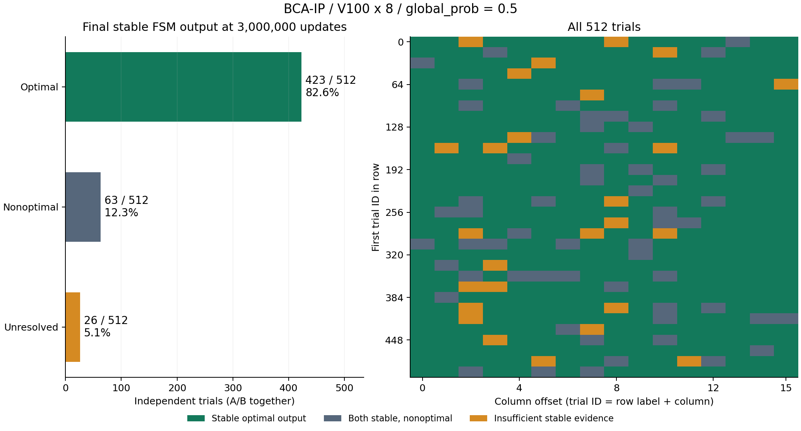
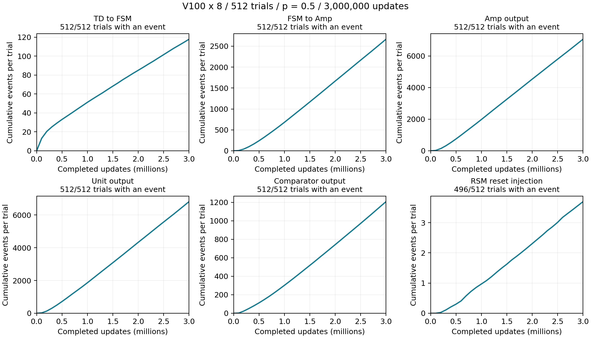
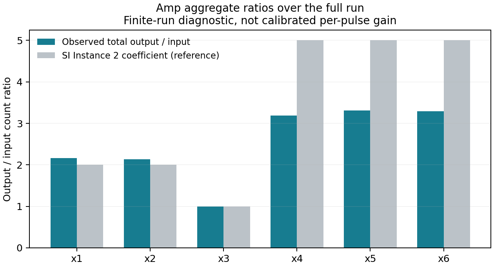

# V100 512試行・300万更新の完了結果

2026-09-28確認・追記。**全512試行が完走。終了時点の安定したFSM出力から読むと、423/512試行（82.6%）でA/Bの少なくとも一方が最適解を出力していた。** 両側とも安定した非最適解は63試行（12.3%）、安定判定に届かないものは26試行（5.1%）。

さらに最低継続時間を10万→4万更新へ短縮すると、終端保持425/512（83.0%）、途中も含む到達確認430/512（84.0%）。[判定短縮と未到達82試行の出力変化の解析](short-stability-and-nonhits.md)を追加した。両数の差5試行では、最適解側へのresetまたはresetなしの流量低下を観測した。

ユーザー指定の「最後の流量変化後の継続的なFSM出力を解と読む」方法で集計した。内部状態の専用判定器がないことを理由に出力履歴の集計を止めた先の説明を訂正する。[判定方法・全試行の解・条件依存性](fsm-readout.md)に詳細を記載。これは300万更新終了時の保持解の統計であり、最初に到達した時刻の統計とは区別する。



## 実行結果

| 項目 | 結果 |
| --- | --- |
| PBSジョブ | `236962.rokko1` |
| 開始 | 2026-09-26 21:06:59 JST |
| 終了 | 2026-09-27 18:14:48 JST（PBS mtime） |
| 使用walltime | 21:07:45 |
| 状態・終了コード | F、Exit_status=0 |
| 試行・更新数 | 64試行/GPU × 8 V100 = 512試行、全試行3,000,000更新 |
| 条件 | global_prob=0.5、seed=20260924、global trial IDs 0..511 |
| 実装 | CUDA、independent Philox4x32-10、candidate capacity=4096 |
| 保存 | 全8 rankで最終checkpointとsummary、`stopped=false` |
| 実測スループット | 約20,213 trial-updates/s（8 GPU合計、Engine elapsed基準） |

各rankのCUDA allocated memoryは全履歴で1,404,225,536 bytes。PBSの親プロセスのmem値をGPUメモリ使用量として解釈していない。

## 全イベントの集計

A/B両Unitは同じ1試行の回路であり、独立試行として倍に数えていない。

| 観測段 | 全イベント数 | 1回以上観測した試行数 |
| --- | ---: | ---: |
| TD→FSM | 60,302 | 512 / 512 |
| FSM→Amp | 1,363,691 | 512 / 512 |
| Amp出力 | 3,608,570 | 512 / 512 |
| Unit出力 | 3,484,454 | 512 / 512 |
| Comparator出力 | 617,405 | 512 / 512 |
| RSMのreset注入 | 1,890 | 496 / 512 |

ResetはA側986回、B側904回。`set`と`clear`は1つの注入を実現する2イベントなので、表では`set`だけを数えた。全ての組について試行・時刻・対象Unitの一致を検査した。rawレコード数は両方を含めて9,138,202件。

495試行では、reset信号を注入した側のUnitに、その最初の注入後にもTD→FSM入力イベントがある。これは注入後の入力継続を示すが、Weightの完全な復元や、その後の候補の最適性を証明するものではない。

最後の100,000更新にも、全512試行でFSM・Amp・Unit出力、510試行でComparator出力がある。全体が途中で停止したまま履歴だけが進んだという結果ではない。RSM信号0回の16試行は `1,9,21,31,40,49,104,196,198,244,251,284,296,346,378,438`。**この16試行を最適解未発見の失敗として数えない。**



図は100,000更新ごとの集計による、1試行あたり平均累積イベント数。最適解への到達CDFではない。

## FSM出力からの最適解の読み出し

増幅前の `A_x1output`〜`A_x6output`、`B_x1output`〜`B_x6output` の継続的な信号を変数ベクトルと読む。これは本文 `v3_main/05_bca_ip_verification.tex:90`、SI `v3_SI/04_additional_simulation.tex:31` の読み方に対応する。全期間で一度でも出た線のORにはせず、各Unitの最後の流量変化後の終盤区間を使用する。

最終流量変化から10万更新以上経過し、最大30万更新の読み出し区間を4分割したうち3区間以上に繰り返し出力する線を1とした。0と読む線は累積2イベント以下、それ以外は不明とする。最適解との一致を使って曖昧なビットを補正しない。423成功試行では0と読んだ線は全て実際に0イベントであり、単発ノイズの許容数を0にしても成功数は変わらない。

評価対象のSI Instance 2は `a=[1,1,2,2,4,4]`、`b=8`、`c=[2,2,1,5,5,5]`。全64ベクトルの列挙により、最適値14、最適解 `[1,1,0,1,0,1]` / `[1,1,0,1,1,0]` を確認した。423試行の内訳はAのみ199、Bのみ209、両方15で、A/Bを独立試行として二重に数えていない。

観測上の流量変化・安定性には判定条件が入る。終盤区間の上限を20万更新にすると419試行、最後の流量変化後の全区間を使うと422試行。変化点ペナルティを10/20/30と変えると411/423/425試行だった。[詳細な感度分析](fsm-readout.md)も併記し、423を判定法によらない真の内部状態数とは主張しない。

## Amp出力比の位置づけ

Ampの全期間の出力数/入力数は次の値だった。入力はFSM→Amp、出力はAmp出力イベントのA+B合計。

| 変数 | 観測した出力/入力数 | SI Instance 2の係数（参照） |
| --- | ---: | ---: |
| x1 | 2.1669 | 2 |
| x2 | 2.1352 | 2 |
| x3 | 0.9968 | 1 |
| x4 | 3.1918 | 5 |
| x5 | 3.3079 | 5 |
| x6 | 3.2882 | 5 |



これは有限期間の総数比で、入力パルスとその全出力を対応付けた校正ではない。また原稿 `v3_main/06_conclusion.tex:61` は、×5設定の実際の増幅率が約×3.5で飽和することを既に記載している。したがって約3.2〜3.3という観測を新たな不具合の証拠としたり、増幅前FSM出力による解の集計を止める理由にしたりしない。係数に対する増幅誤差が探索性能へ及ぼす影響は、出力解の成功率とは別に評価できる。

## 保存と検証

全データをローカルの `results/production-p05-20260928/` に取得した。元データは同ディレクトリ内の `bca-ip-512-trials-p05-20260925/` にあり、8個のcheckpointには最終512セル空間を保持する。取得アーカイブは81,845,628 bytes、SHA-256は[download.json](download.json)に記録。

検査結果はエラー0件。

- 8個のcheckpointのSHA-256が、rokko上で計算した値と一致。
- checkpoint内manifestと外部manifestが完全一致、全8 rankが3,000,000更新・64試行。
- 全512 trial IDが重複なく0..511を構成。
- 全512セル空間の形状・値域・静的配線が初期格子と整合。最終状態は全512個が互いに異なる。
- 全24,000履歴chunkのSHA-256・範囲の連続性・レコード数・イベント名・試行ID・重複を検査。
- 元のセル空間、規則、イベント、20個のcore/api実装のハッシュが一致。
- 同じseed・global trial IDs 0,1の最初の100,000更新の242イベントが、先行V100 p=0.5診断と時刻・名前を含め完全一致。

詳細: [audit.json](audit.json)、[PBS状態とハッシュ](job-status-and-sha256.txt)、[Amp比率の元集計](amp-ratios.json)。`audit.json` は当初の保存整合性・モジュールイベント監査をそのまま残したもので、追加のFSM出力読み出しを含まない。終端FSM出力の集計は別ファイル [fsm-readout-summary.json](fsm-readout-summary.json)、全512試行の読み出しは [fsm-readout-trials.jsonl](fsm-readout-trials.jsonl)。モジュール図の元データは[event-counts.npz](event-counts.npz)、作図は[plot_results.py](plot_results.py)。大容量のraw履歴とチェックポイントはGit管理対象外。

```sh
PYTHONPATH=src python3 scripts/audit_bca_ip_run.py \
  results/production-p05-20260928/bca-ip-512-trials-p05-20260925 \
  --output results/production-p05-20260928/audit \
  --remote-hashes results/production-p05-20260928/job-status-and-sha256.txt \
  --reference-probe results/cellspace-review-20260926/probe-global-prob-0.5-20260925

MPLCONFIGDIR=/tmp/pybca-production-mpl python3 \
  docs/experiments/2026-09-28-production-p05/plot_results.py
```

集計のみを行い、新しいシミュレーション、原本への書き込み、再投入、実行条件変更は行っていない。
