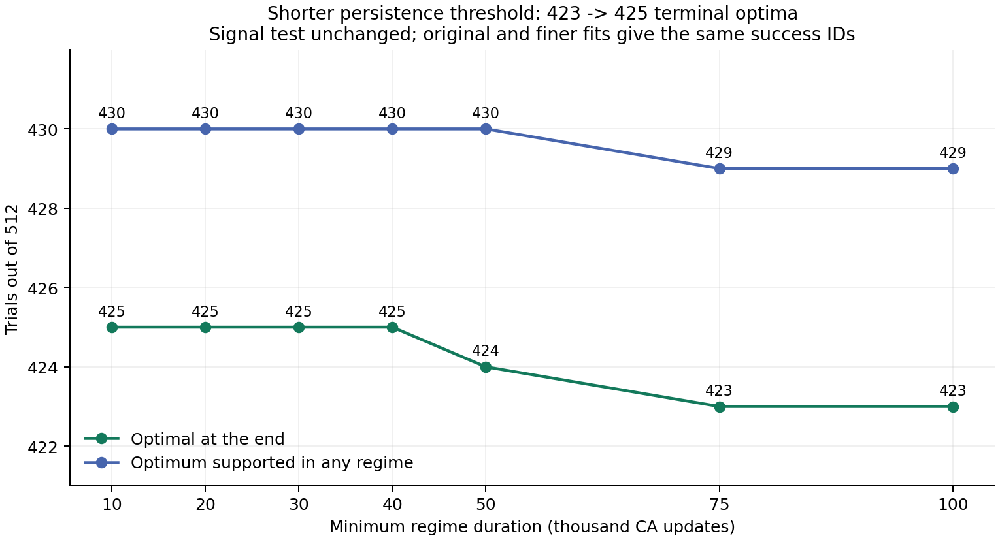
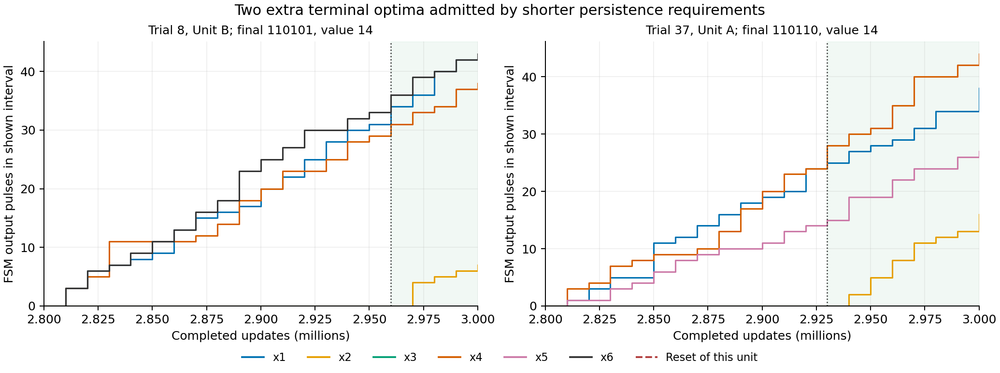
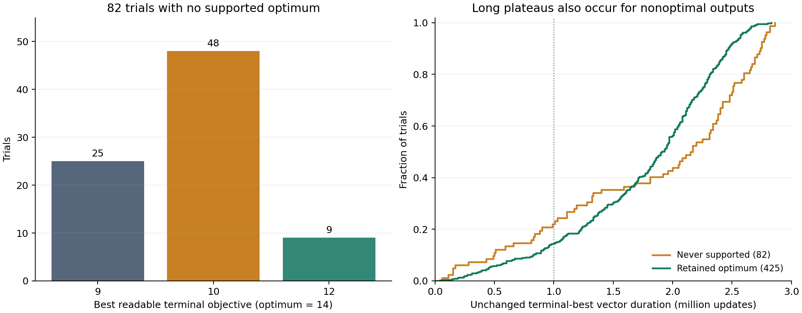
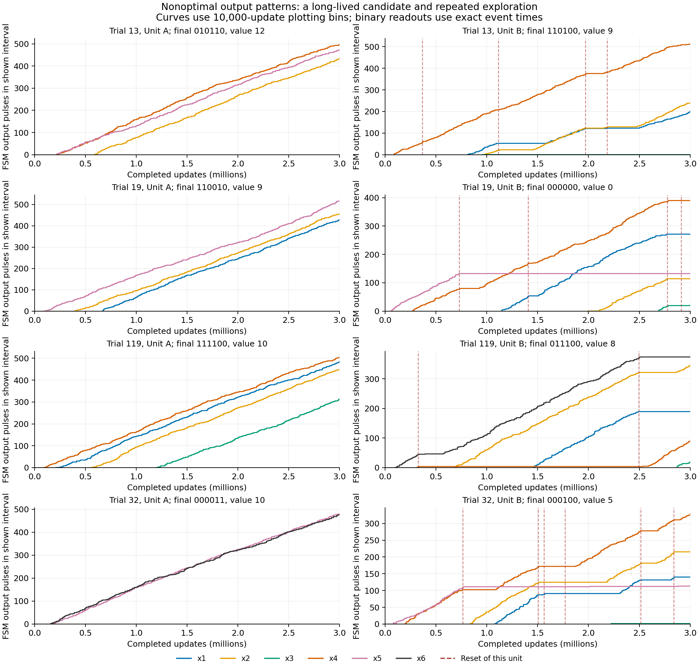
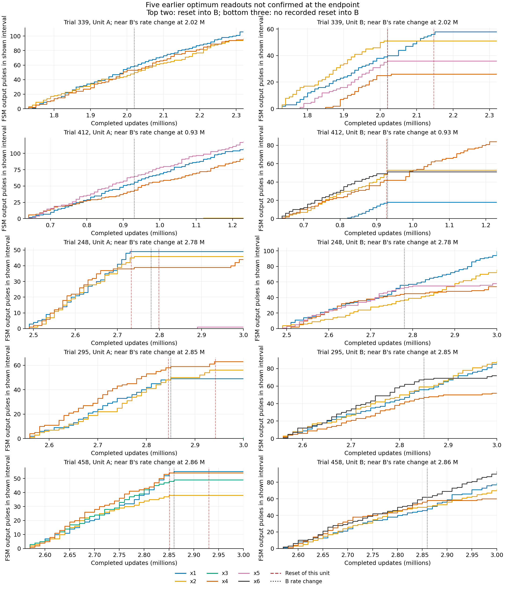

# 安定判定の短縮と、未到達ケースの出力変化

2026-09-28。rokko `236962.rokko1` の512試行、global_prob=0.5、3,000,000更新の同じ履歴を解析した。

**最低継続時間を10万→4万更新へ短縮すると、終了時の最適解出力は423→425/512（83.008%）に増えた。1万まで短縮しても425だった。途中の区間も含めて一度でも最適解の持続出力を確認した試行は430/512（83.984%）。観測上未到達の82試行では、非最適解を長く保ったまま別の候補の出力が変わるパターンが多い。**

「到達した後もその解が続く」と扱う場合の集計は430試行となる。ただし実測終端との差5試行を残す。2試行では最適解を出していた側へRSMリセットが入り、3試行ではその側へのresetなしで出力が弱まるか止まった。到達の観測と、その後の保持は同じ事象ではなかった。

## 最低継続時間を短くした結果

| 最低継続時間 | 終了時に最適解を出力 | 割合 | 全区間のどこかで最適解を確認 | 割合 |
| --- | ---: | ---: | ---: | ---: |
| 100,000更新（前回） | 423 | 82.617% | 429 | 83.789% |
| 75,000更新 | 423 | 82.617% | 429 | 83.789% |
| 50,000更新 | 424 | 82.813% | 430 | 83.984% |
| 40,000更新 | 425 | 83.008% | 430 | 83.984% |
| 30,000更新 | 425 | 83.008% | 430 | 83.984% |
| 20,000更新 | 425 | 83.008% | 430 | 83.984% |
| 10,000更新 | 425 | 83.008% | 430 | 83.984% |

変更したのは、最後の流量変化から必要とする**最低継続時間**。6本の信号を読む条件は前回と同じで、区間終盤の最大30万更新を4等分し、合計4イベント以上かつ3区間以上で出力する線を1、合計2イベント以下を0とする。変数の最適解への一致を使って不明ビットを補完しない。A/Bは同じ1試行として数える。問題はSI Instance 2、最適値14、解は `110101` または `110110`（左からx1〜x6）。

元の分割は10,000更新刻み・最短区間30,000更新だった。短い判定がこの制限に隠れないよう、5,000更新刻み・最短区間5,000更新でも変化点を再計算した。上表の全条件で、終端最適解・全区間での到達の**試行ID集合まで一致**した。



増えた2試行は次のとおり。

| 試行・Unit | 最後の流量変化 | 観測された継続 | 読んだ解 | x1〜x6の出力数 |
| --- | ---: | ---: | --- | --- |
| 37・A | 2,930,000 | 70,000 | `110110` | `[13,16,0,16,12,0]` |
| 8・B | 2,960,000 | 40,000 | `110101` | `[8,7,0,7,0,7]` |



ここで「最低継続時間を1万にする」は「過去の出力を全て捨て、最後の1万だけを見る」という意味ではない。後者も対照として計算すると、4イベント・3/4区間という出力の条件の下では、最大観測窓10万で385、5万で213、2万で3、1万で0となった。信号数が足りなくなるためで、回路の最適解到達が0になったという意味ではない。最低継続時間の緩和と、観測窓そのものの短縮を混同しない。

## 最適解を一度も確認できなかった82試行

10,000更新の最低継続時間で、どの流量区間にも最適解を読めなかった試行を対象とする。各試行の終端で判読できる側のうち、目的値が高い方を集計した。13試行では相手側の出力が未確定なので、その側まで非最適と断定した分類ではない。

| 終端で読める最良の目的値 | 試行数 | 主なベクトル | 最適解に向けて必要な変化 |
| --- | ---: | --- | --- |
| 9 | 25 | `110100`, `110010`, `110001` | x4・x5・x6のいずれか1本の立ち上がり |
| 10 | 48 | `111100`, `111010`, `111001`, `000011` | 選択済み変数の一部を解除して入れ替える必要がある |
| 12 | 9 | `100101`, `010110`, `100110` | x1またはx2の立ち上がり |

例えば `111100` は制約量6、残容量2である。x5/x6は制約量4を必要とするため、x3を解除するなどの入れ替えが必要になる。`000011` はx5とx6だけで容量8を使い切る。一方 `110100` は残容量4なので、x5/x6のどちらかが出力すれば最適解になる。これは読まれたベクトルと問題の制約からの分類であり、内部Weight/Key Tokenの詰まりを直接観測した診断ではない。



82試行の動きには次の特徴があった。

- **64/82試行**で、終端で最良だった側の同じ出力ベクトルが100万更新以上続いていた。継続時間の中央値は216万更新。
- **59/82試行**では、最後の50万更新にも少なくとも一方で新しい判読ベクトルが現れた。流量の変化だけでなく、読めた6ビットの変化を数えた。
- 上の両方を満たすものが**45試行**。片側の長い停滞と、もう片側の候補更新が同居している。
- **81/82試行でRSMリセットが発生**。合計323回、中央値4回、範囲0〜9回。最終最適解がある425試行も中央値4回なので、リセット回数の不足だけでは差を説明できない。
- 最後の50万更新にも39/82試行で計57回のresetがあった。全体が止まっているケースだけを数えているわけではない。

同じベクトルの継続時間は、同じ読み出しベクトルが続く隣接流量区間を連結した推定値。未確定の区間を挟んで延長しない。変化点の時刻精度は元の10,000更新刻みであり、内部状態が変わった厳密な時刻ではない。

## 未到達例の時系列

| 試行 | 主に保持される側の解 | 目的値 | 終端まで同じ解が続く推定時間 | もう片側 |
| --- | --- | ---: | ---: | --- |
| 13 | A:`010110` | 12 | 242万更新 | Bに4回reset。Aのx1が立ち上がらない |
| 19 | A:`110010` | 9 | 234万更新 | Bに4回reset。Aのx4が立ち上がらない |
| 119 | A:`111100` | 10 | 181万更新 | Bに2回reset。Aはx3を含む非最適解を保持 |
| 32 | A:`000011` | 10 | 286万更新 | Bに6回reset。Aはx5/x6で容量を使い切る |

これらは「非最適解が安定しているため、比較対象のUnitが探索を繰り返すが、300万更新までに改善解を出せない」出力の例である。唯一resetが0回の未到達例はtrial 438で、A:`110010`（値9）とB:`000011`（値10）がそれぞれ255万・277万更新続く。



## 一度出た最適解を終端で確認できなかった5試行

全てB側で過去の最適解を観測したが、その後の状況は二通りに分かれる。

| 試行 | 最適解を読めた流量区間 | その解 | その後のB側 |
| --- | --- | --- | --- |
| 339 | 177万〜202万 | `110110` | **2,019,958更新でBへreset**。終端は`110100`、値9 |
| 412 | 81万〜93万 | `110101` | **927,460更新でBへreset**。終端は`111100`、値10 |
| 248 | 121万〜278万 | `110110` | Bへのresetは全期間0回。終端はx5が間欠的で`1101?0` |
| 295 | 93万〜285万 | `110101` | Bへのresetは全期間0回。終端はx6が間欠的で`11010?` |
| 458 | 226万〜286万 | `110101` | Bへのresetは全期間0回。x4が減衰し、終端は`110001`、値9 |

区間の6ビットは、その区間の後半の持続出力から読んだもの。表の開始時刻を、そのまま最適解の厳密な初到達時刻とみなさない。

reset直前のFSM出力も読み直すと、trial 339はAが値9・Bが14、trial 412はAが12・Bが14だった。一方、増幅後のUnit出力数とComparator出力は次のとおり。保存raw履歴から直接数えた。

| 試行 | reset前30万更新のUnit A/B出力数 | Comparator A−B / B−A |
| --- | --- | --- |
| 339 | 512 / 362 | 154 / 0 |
| 412 | 619 / 527 | 130 / 0 |

**ベクトルとしての目的値ではBが高くても、比較器へ届くトークン流量ではAが上回っている。** trial 412の直前10万更新ではA/Bが182/184まで接近するが、ComparatorのA−B出力は26回残る。候補の出力開始直後の流量、Amp、Comparator/RSMの応答時間を切り分ける必要があり、この集計だけでRSMの配線やGPU実装の不具合とは断定しない。

残る3例では、Bへのresetイベントがないにもかかわらず、その最適解を構成する線の流量が下がる。Aへのresetと近い時期に起きているが、時刻が近いことだけで因果関係とはしない。これは「最適解到達後は必ず保持する」という仮定とは別に、回路の保持特性として調べるべき現象である。



## 実験結果としての扱い

短い判定での**到達の観測率は430/512=83.984%**、**終了時の最適解保持率は425/512=83.008%**。最低継続時間を短くすることで増える終端成功は2試行で、判定時間をさらに短くするだけでは大きく増えない。

未到達82試行は、単に全てが停止した結果ではない。非最適解の長い保持、反対側の探索更新、容量を使う変数の選び直しが必要な候補、出力開始待ちが混在する。保持側の診断では、特に上の2件の最適解側resetと3件のresetなしの流量減少が優先対象となる。再計算やジョブの追加投入は行っていない。

## データと再現

- [short-stability-summary.json](short-stability-summary.json)：全継続時間・両変化点分割の集計と試行ID。短い観測窓のみ使う対照も含む。
- [nonhit-summary.json](nonhit-summary.json)：未到達82、保持425、過去のみ5の集計。
- [nonhit-trials.jsonl](nonhit-trials.jsonl)：全82試行のA/Bの解・reset時刻・同じ解の継続時間・判読解の変化。
- [nonhit-example-regimes.jsonl](nonhit-example-regimes.jsonl)：図の代表例を含む区間ごとの解・出力数。
- [nonhit-reset-context.json](nonhit-reset-context.json)：trial 339/412のreset前のUnit/Comparator出力数。
- [short-stability-cases.json](short-stability-cases.json)：追加の2成功例と主な比較例。
- [plot_stability_dynamics.py](plot_stability_dynamics.py)：図の生成コード。

```sh
OPENBLAS_NUM_THREADS=1 python3 scripts/sweep_bca_ip_stability.py \
  results/production-p05-20260928/fsm-readout \
  --output results/production-p05-20260928/short-stability

OPENBLAS_NUM_THREADS=1 python3 scripts/analyze_bca_ip_nonhits.py \
  results/production-p05-20260928/fsm-readout \
  --sweep results/production-p05-20260928/short-stability \
  --output results/production-p05-20260928/nonhit-dynamics

python3 -m unittest discover -s tests -p 'test_*fsm*.py' -v
python3 -m unittest discover -s tests -p 'test_nonhit_dynamics.py' -v
MPLCONFIGDIR=/tmp/pybca-steady-mpl python3 \
  docs/experiments/2026-09-28-production-p05/plot_stability_dynamics.py
```

到達済み集合と終端保持集合を独立に照合し、後者が前者に含まれることを全条件で検査。しきい値を緩めたときの集合包含、前回423試行の再現、粗い/細かい分割での成功ID一致、到達後に失われる例の区別、A/Bの二重計数防止、未確定区間をまたぐ継続時間の水増し防止など、関連17テストを通した。
