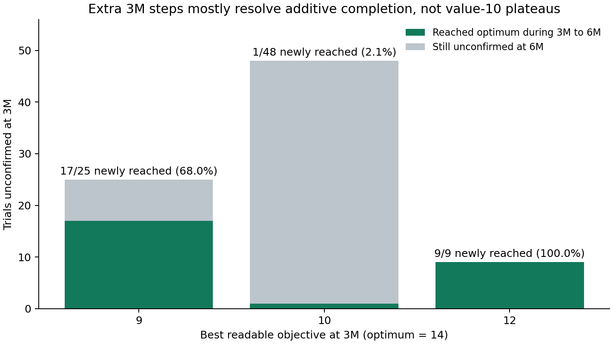
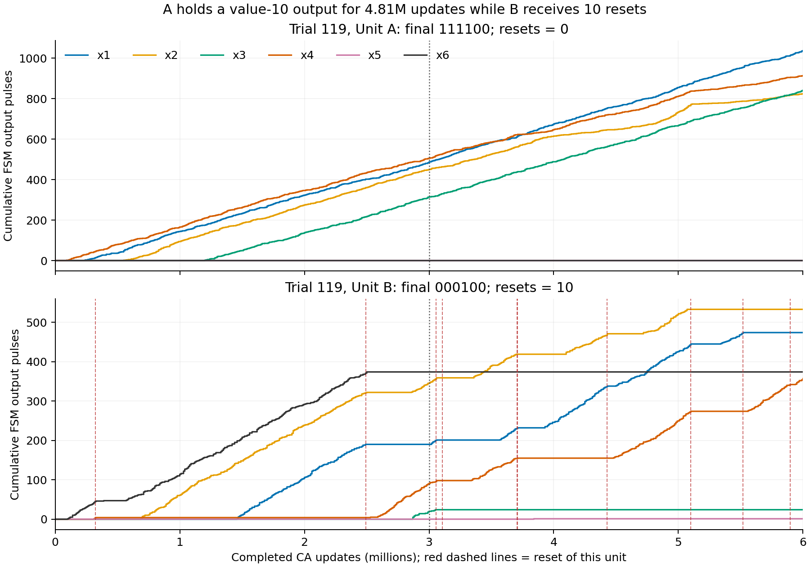
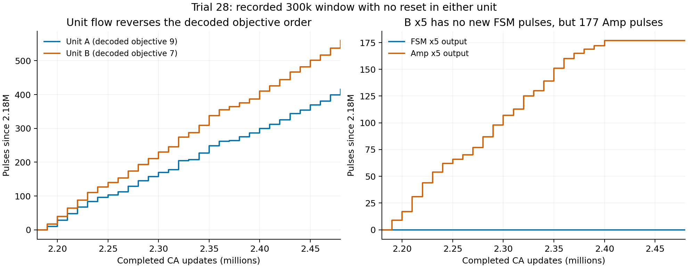

# 600万更新で未到達の55試行：停滞と次の実験

2026-10-01。現行セル空間、global_prob=0.5、512試行の記録を再解析した。到達は457/512、終端保持は446/512で、判定規則は[到達率レポート](report.md)と同じ。ここで扱う55試行は、600万更新を通じて最適解の持続出力を一度も確認できなかった集合である。途中で最適解が出たが終端では確認できない11試行は別集計にした。

**残った試行の主な特徴は、非最適な目的値10の出力を片側が保持し、もう片側がリセットと候補更新を繰り返すことだった。** また、FSMの出力ベクトルから計算した目的値の順序と、Unit/Comparatorの流量の順序が逆になる区間もある。前者の停滞と後者の応答を観測できたが、内部Weightの復元不足・残留トークン・確率的な応答遅れのどれが主因かは、この出力ログだけでは確定できない。

## 追加300万で何が解消し、何が残ったか

300万時点の未到達82試行を、その時点で判読できた最良の目的値で層別した。同じtrial IDを600万まで追跡している。

| 300万時点の最良の目的値 | 対象 | 追加300万で新規到達 | 未到達のまま |
| --- | ---: | ---: | ---: |
| 9 | 25 | 17（68.0%） | 8 |
| 10 | 48 | **1（2.1%）** | 47 |
| 12 | 9 | **9（100%）** | 0 |

値9・12の出力は不足変数を追加して最適解にできる。値10の出力は選択済み変数の解除を必要とする。延長による改善に大きな差がある。ただしこれは途中結果で層別した観測結果であり、独立した条件比較実験でも、さらに延長した場合の成功確率の予測でもない。



600万時点の未到達55試行では、判読できる側のうち目的値が高い方を採用すると次のようになる。同値なら、同じ出力が長く続いた側を表示した。

| 最良の判読出力 | 目的値 | 試行数 | 最適解に向けた変化 |
| --- | ---: | ---: | --- |
| `111100` | 10 | 42 | x3を解除しx5またはx6を追加 |
| `111010` / `111001` | 10 | 3 / 5 | x3を解除しx4を追加 |
| `000011` | 10 | 1 | x5/x6の一方を解除しx1,x2,x4を追加 |
| `110100` / `110001` / `110010` | 9 | 各1 | 不足するx4,x5,x6のいずれかを追加 |
| `010100` | 7 | 1 | x1とx5またはx6を追加 |

**51/55試行が目的値10で、最良の判読出力から最適解へは変数の入れ替えが必要。** 53/55試行で同じ最良出力が100万更新以上続き、継続時間の中央値は384万更新だった。時間は隣接する判読可能な出力区間をつないだ推定で、内部状態の固定時間ではない。未確定の区間を挟んで延長していない。

55試行中12試行は相手側の終端出力が未確定である。この表は、その側の内部状態まで非最適と断定するものではない。

## リセットは発生しているが、保持側は替わりにくい

- 未到達55試行すべてにreset注入の記録があり、合計417回、中央値8回、範囲3〜12回。終端最適446試行も中央値8回で、回数の不足だけでは説明できない。
- 終端まで同じ最良出力を保った区間内では、その保持側へのresetは55試行すべてで0回。一方、相手側には54/55試行でresetが入っていた。
- 最後の50万更新にも31試行でreset、30試行で新しい判読ベクトルが現れた。28試行は「保持側が100万更新以上同じ出力」と「相手側の最近の候補更新」を併せ持つ。

例えばtrial 119はAが `111100`（値10）を約481万更新保ち、全600万でAへのresetは0回、Bには10回あった。Aのx1〜x4の累積出力は伸び続け、x5/x6は立ち上がらない。Bは出力線を替えながら探索している。`111100` は容量6を使い残容量2なので、必要量4のx5/x6を足すにはx3などを解除する必要がある。



同じUnit内の追加だけでは改善できない非最適解が保持され、相手側がそれを上回る出力を作れないという停滞が、記録と整合する。比較が候補の形成途中でresetを起こす可能性や、reset後のWeight/Key/Ansの復元状態も調べる必要がある。resetのログはトリガの注入を示し、内部復元の完了を保証しない。

参照した論文ソース `BCA-IP_2026-09-17/revised/v3_SI/02_internal_design.tex` のFSM節では、Weight Pre Poolが空になるとAnsループが持続出力し、Key TokenがL2に残る動作を説明している。同ファイルのRSM節には、RSMの出力はresetトリガであり、必要なWeightの復元には問題設定に応じた数のトークンを供給する仕組みが必要との制約が明記されている。今回のセル空間でそれが正しく復元されているかは、内部プールを直接計測する対象である。

## FSMの解とUnit/Comparatorの比較結果が一致しない区間

A/Bの両方に検出された流量変化点で時系列を区切り、両側とも30万更新以上同じ区間にいる場合、その最後の30万更新を読む。両側が判読可能かつ実行可能な区間だけで、FSMの解の目的値とUnit流量の順位を比べた。

| 試行集合 | 判読できた区間 | 目的値同値 | 目的値が異なる区間の順位一致 | 順位逆転 |
| --- | ---: | ---: | ---: | ---: |
| 一度も最適解未確認（55試行） | 350 | 70 | 266 | 14 |
| 終端で最適解（446試行） | 2,787 | 185 | 2,576 | 26 |
| 過去のみ最適解（11試行） | 78 | 8 | 66 | 4 |

未到達群では、同値を除く280区間中14区間（13試行）で逆転した。うち4区間には窓内でA/Bどちらにもresetがない。Comparatorの向きも未到達群で14区間が逆転、1区間が同流量だった。各区間は同じ試行内で相関するため、独立試行の誤判定率としては扱わない。30万未満の過渡区間も対象外である。

具体例はtrial 28の218万〜248万更新。この窓内にはA/Bいずれにもresetがなく、以下を実測した。

| 指標 | A | B |
| --- | --- | --- |
| FSMの判読出力 | `110100` | `100100` |
| 目的値 | **9** | **7** |
| FSM x1〜x6のイベント数 | 47,60,0,52,0,0 | 55,0,0,39,0,0 |
| Unit出力数 | **415** | **560** |
| Comparatorの対応側優位出力 | A−B: 0 | B−A: 148 |

特にBのx5は、この30万更新でFSM出力が0なのにAmp出力が177あった。以前の入力に対するAmpの残留出力・応答遅れを疑う具体的な根拠になる。ただし、これだけで配線誤りやトークン生成のバグとは判断できない。窓の前に入った信号の応答や、各出力線の発火頻度の差も含むためである。



全群を通じて「片側が最適解、他方が非最適解」と判読できた2,217区間では2,215区間のUnit流量順位が一致し、逆転は2区間だった。長い安定出力の大半では比較の向きが正しい一方、例外と短い過渡応答は到達後の保持を損なう要因になり得る。これも因果関係の確定には制御した試験を要する。

## 次の実験の順序

全512試行をさらに300万延長する前に、次の順で原因を分ける。ここに記載した条件変更実験は未投入。

| 優先 | 実験と規模 | 固定・変更するもの | 判定すること |
| --- | --- | --- | --- |
| 1 | 600万の未到達55状態＋終端最適9状態を各2条件へ分岐。計128実行、V100 2台で64/GPUを目安に10万更新のpilot、その後必要なら100万 | 片方は自然継続。片方は保持側に通常のresetトリガを1回追加。元の状態・seed・trial ID・絶対stepを対応させ、条件IDと出力先を分離 | Weight Pre/Postの個数、Key/Ansの位置、TD再受入れ、解の再選択。reset注入から内部復元までの遅れと、改善候補形成前の再resetを測る |
| 2 | Amp係数1〜5とUnit/Comparatorの段応答。各条件32反復でまず10万更新、減衰が終わらなければ延長 | 制御した同率入力をON→OFF、候補切替え前後の各段の流量を記録 | 入力停止後の出力尾、利得・時間差・順位逆転の持続。trial 28のFSM 0 / Amp 177を正常な段応答で説明できるか |
| 3 | Weight ablation。64独立試行/条件・100万更新のpilotから、動作検証後512試行/条件・同じ固定horizonへ | 現行Weights=[4,4,5,1,1,1]と全変数同一のWeight。a,b,c、Amp、TD、RSM、判定法を揃え、初期状態から開始 | 目的値10の停滞頻度・滞在時間、到達率、終端保持率。変更後のWeightをresetが正しく復元することが前提 |
| 4 | 本論Instance 1の反復統計、候補数を揃えたランダム比較、到達時間の評価 | Instance 1はa=[1,1,2,2,4,4], b=6, c=[2,3,4,5,1,1]。現データはInstance 2 | 論文の別問題・比較条件を埋める。平均到達時間は未到達を除外せず、観測上限と読み出し遅延を扱う |

最初の分岐は原因を調べる介入実験であり、元の512独立試行の成功率には加えない。自然継続側は再開時の結果同一性を確認してから比較する。内部プールの観測位置と通常reset操作を検証する計測コードは次の実装対象。数値上の最適ベクトルをセルへ直接書き込む実験ではない。

V100の既存64試行/GPUでは追加300万が約21.16時間だった。同じ速度なら100万は約7.05時間/GPUだが、詳細観測を加えた条件の速度はpilotで再測定する。現在の観測結果だけで900万時点の成功率を外挿しない。

## データ・再現・検証

- [55試行の各Unit出力と全reset時刻](nonhit-trials.jsonl)、[保持側と相手側のreset](nonhit-leaders.jsonl)、[55/446/11群の集計](nonhit-summary.json)。
- [段間流量と順位の集計](stall-diagnosis-summary.json)、[全判読区間](joint-stable-intervals.jsonl)、[代表的な逆転区間](ranking-examples.json)。
- [全44イベントの1万更新ごとのカウント](stage-counts.npz)：`counts[trial, bin, event]`、512×600×44、`names`がイベント名、`bin_width=10000`。rawイベントの0始まりstepを分割し、完成したCA更新数では `(bin*10000, (bin+1)*10000]` に対応。
- [過去のみ最適だった11試行](earlier-only-trials.jsonl)、[そのreset直前の流量](nonhit-reset-context.json)。
- [公開・集計の検証記録](publication-validation.json)、[SHA256SUMS](SHA256SUMS)、[元データRelease](https://github.com/Minamium/PyBCA/releases/tag/bca-ip-results-2026-10-01)。

全48,000チャンクのハッシュを再確認して19,462,475レコードを数え直した。全44種類の集計は既存監査と一致し、FSMの全ビンも既存のカウント配列と一致した。CPUの53テストは失敗0（CUDA専用3件はローカル環境でskip）。今回の追加は履歴解析と資料の公開で、シミュレーションコアと最適解の判定規則は変更していない。

[元データの取得](../README.md)と[600万の読み出し・前後比較](report.md)を実行後、以下を実行する。図はこのフォルダの `plot_nonhit_diagnosis.py` で再生成できる。

```sh
OPENBLAS_NUM_THREADS=1 python3 scripts/analyze_bca_ip_nonhits.py \
  results/production-p05-6m-20261001/fsm-readout \
  --sweep results/production-p05-6m-20261001/short-stability \
  --output results/production-p05-6m-20261001/nonhit-dynamics

OPENBLAS_NUM_THREADS=1 python3 scripts/diagnose_bca_ip_stalls.py \
  results/production-p05-6m-20261001 \
  --previous-nonhits docs/experiments/2026-09-28-production-p05/nonhit-trials.jsonl \
  --output results/production-p05-6m-20261001/stall-diagnosis
```
