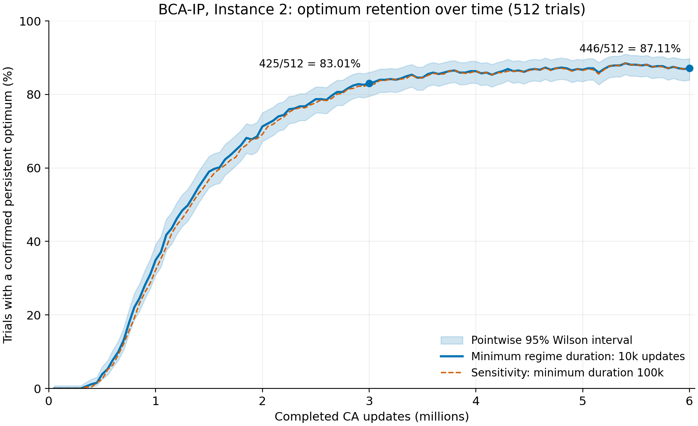

# 最適解の安定出力率の時系列と、論文パラメータNの比較計画

2026-10-05。ここで **Nは試行数ではなく、論文のWeight設定 `W_i = N(c_max-c_i)+1` の係数**。独立試行数は混同を避けてRと表記する。現在の統計はN=1、R=512、global_prob=0.5、SI Instance 2相当の同一問題である。

## 主図：その時点で最適解を安定して出力している割合



横軸は完成したCA更新数、縦軸は「その時点までの信号から、A/Bいずれかに最適解の持続出力を確認できる試行数 / 全512試行」。A/Bはまとめて1試行として数え、判読できない試行も分母に残す。これは時点ごとの出力保持を測る曲線であり、単調増加を強制しない。

主線は最低継続1万更新、破線は10万更新の感度分析。既存の信号規則（最大30万更新の窓、4分割中3区間以上に出力し合計4イベント以上ならON、2以下ならOFF、それ以外は不明）を使う。最低継続時間と観測窓長は別である。将来も最適解が続くことや、内部状態の厳密な安定性まで保証する判定ではない。

5万更新ごとに、その時点までのログだけで流量変化点と最終出力を再判定した。600万の最終解析で見えた解を過去へ塗り戻していない。塗りつぶしは、独立試行を単位とする各時点の95% Wilson区間であり、曲線全体の同時信頼帯ではない。[Wilson区間の式：NIST](https://www.itl.nist.gov/div898/handbook/prc/section2/prc241.htm)。

| CA更新数 | 最適解の安定出力（主線） |
| --- | ---: |
| 100万 | 179/512、34.96% |
| 200万 | 365/512、71.29% |
| 300万 | 425/512、83.01% |
| 400万 | 442/512、86.33% |
| 500万 | 444/512、86.72% |
| 600万 | 446/512、87.11% |

300万・600万の主線と感度線は、既存集計と試行ID集合まで一致した。400万以降の改善は小さいが、有限時間の記録なので漸近的な上限が87%と確定したわけではない。

論文ではこの図を主図とし、別パネルまたは表で累積到達率を示すのがよい。既存の「一度でも持続出力を確認」は300万で430/512=83.98%、600万で457/512=89.26%。これは全履歴を用いた事後判定であり、今回の時点ごとの判定を単純に累積した曲線とは定義が異なる。累積曲線を追加する際は、過去のみを使う確認時刻の定義を固定して再集計する。区間の開始を初到達時刻として扱わない。

論文用図注案：

> Fraction of independent trials with a confirmed persistent optimal FSM output as a function of completed CA updates. The circuit uses N=1 and global_prob=0.5 for Instance 2 (512 trials). Each readout uses only events available up to the corresponding time; either Unit may support success and each trial is counted once. The solid and dashed curves use minimum regime durations of 10,000 and 100,000 updates, respectively, with an observation window capped at 300,000 updates. Shading indicates pointwise 95% Wilson confidence intervals across trials. Unresolved readouts remain in the denominator.

## 論文のNを増やす実験には価値がある

参照した添付論文は `shukunami2026BCAIP_revised_v3.pdf`。§4.4・式(4)、pp.14–15で、Nは目的係数1単位に対応するトークン数であり、大きな目的係数を持つ変数への選択バイアスを強める一方、出力までに消費するWeightが増えると説明されている。§5.1、pp.17–18では、RSMのreset動作を観測する更新数を抑えるためN=1を選んだとしている。論文はN=1が最適性能を与えるとは主張していない。

今回のInstance 2では `c=[2,2,1,5,5,5]`、従って以下になる。a,bとAmpの倍率cは変えない。

| N | W1,W2,W3,W4,W5,W6 | 1 UnitのWeightトークン総数 |
| --- | --- | ---: |
| 1（既存） | 4,4,5,1,1,1 | 16 |
| 2 | 7,7,9,1,1,1 | 26 |
| 5 | 16,16,21,1,1,1 | 56 |

既存の未到達55試行のうち51試行で最良の判読出力は目的値10。42試行は `111100` で、目的係数1のx3が容量を消費しており、最適解にするにはx3の解除とx5/x6の追加が必要だった。Nを上げることでこの選び方を減らせるかを調べるのは、現在の停滞に直接対応した比較になる。

ただし、Nを上げれば必ず改善するとは予測しない。x1・x2のWeightも大きくなるため、最適解に必要なこの2変数の出力が遅くなり得る。また、目的係数が同じ5のx4,x5,x6の間にはNによる差がつかない。例えばx5,x6を先に選んだ `000011` は容量8を使い切り、目的値10に留まる。TDの制約閾値や実際の入力率との組合せで、停滞先が変わる可能性がある。これらは式と制約からの仮説で、N>1の統合実験は未実施。

## 比較する条件と順序

主比較は **N=1,2,5、同じ試行数R=512、同じ600万CA更新**。N=1には既存データを使う。初期状態からの新しい試行として比較し、600万時点のセルへ追加Weightを入れた継続をN>1の性能統計には混ぜない。最終図ではNを色で区別し、試行数はRとして注記する。

1. **設定とresetの確認。** N=2,5の初期Weight個数、プール収容数、A/Bの対称性を検査する。添付論文§5.2、p.19にはreset入力のSimple Ampによる補償が記載されている。Nを変えた後も各resetが変更後のWeightを回復できることを直接測る。初期トークン数だけを増やして検証を省かない。
2. **N=2,5を各64試行でpilot。** 100万更新を最初の観測点にし、FSM出力とreset復元、速度、保存容量を確認する。出力が遅い条件を100万時点だけで失敗と結論せず、必要なら同じpilotを継続する。
3. **動作検証後、各R=512・600万更新へ。** 同じ問題、global_prob、判定規則、step上限で比較する。独立試行を識別できるseed・trial ID・条件IDを保存する。N以外に必要な回路変更があれば明記する。
4. **補助指標で速度と選択の違いを分ける。** 主指標は時点ごとの安定出力率。併せて `111100` / `000011` / 最適解の割合、判読不能率、reset後の候補形成時間を記録する。長時間化の効果を調べる場合は全条件で共通の追加horizonを設ける。横軸をt/Nにしただけで公平性を仮定しない。

均一Weight `W_i=1` はバイアスなしの対照（式上はN=0相当）として別条件にできる。まずN=2,5で速度と最適解出力の関係を確認すれば、論文の「Nによる選択バイアスと計算時間のトレードオフ」を統合回路の統計で評価できる。現時点では新しいGPUジョブを投入していない。

## 再現と保存物

- [主図PNG](optimum-retention.png)、[編集・組版用SVG](optimum-retention.svg)。
- [全120観測点の集計](retention-curve.json)、[各trial・時点の状態と変化点](retention-trial-states.npz)。NPZの`states[duration, trial, time]`は0=未確定、1=判読可能な非最適、2=最適。`durations`、`steps`を同梱。
- [検証記録](validation.json)。関連17テスト成功、3M/6Mの各2条件で既存ID集合と完全一致。既存のシミュレーションコア・読み出し関数は変更していない。

```sh
OPENBLAS_NUM_THREADS=1 python3 scripts/plot_bca_ip_retention.py \
  results/production-p05-6m-20261001/fsm-readout \
  --output docs/experiments/2026-10-05-retention

PYTHONPATH=src:tests python3 -m unittest \
  test_retention_curve test_fsm_output_readout test_short_fsm_stability
```

入力となるFSMイベント時刻は、[公開済みrawデータ](https://github.com/Minamium/PyBCA/releases/tag/bca-ip-results-2026-10-01)を[既存の手順](../2026-10-01-production-p05-6m/report.md)で解析して再生成できる。
