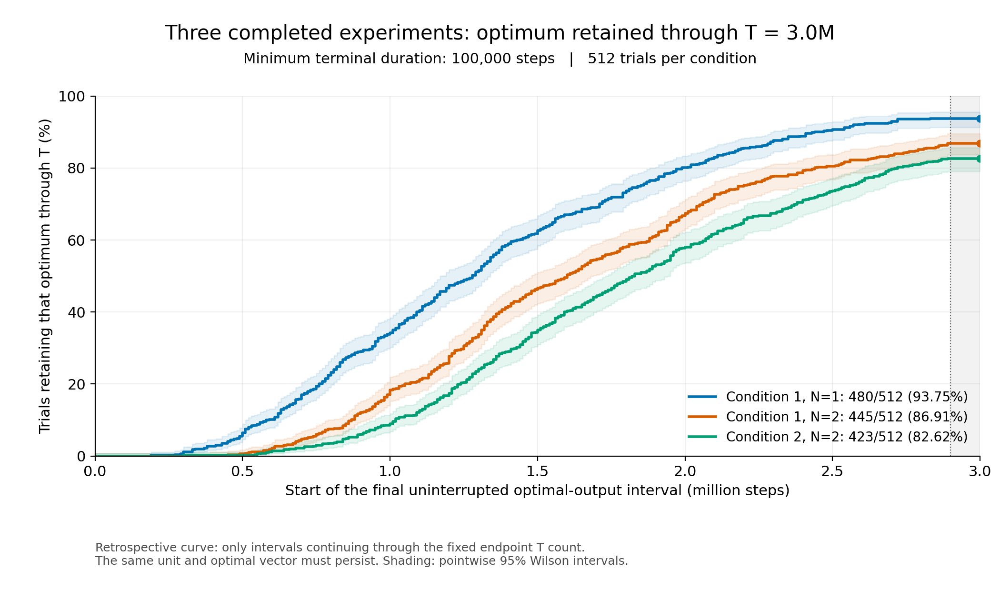
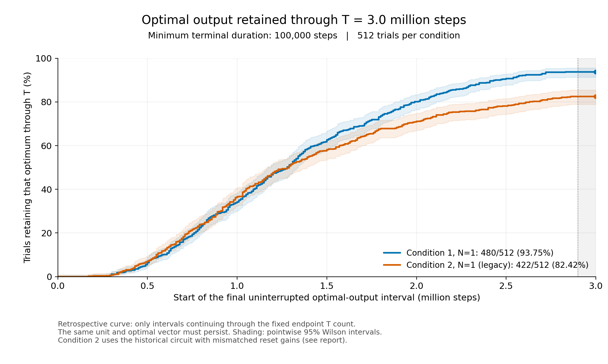

# BCA-IP 実験結果

## 3条件の300万ステップ実験は完了（2026-10-11）

条件1・N=1、条件1・N=2、条件2・N=2は、いずれも全512試行が300万ステップを完走した。PBS終了コードはすべて0で、ジョブ末尾の履歴・最終チェックポイント・セル形状の監査も成功している。global_prob=0.5、独立試行、各8台のV100で実行し、条件間ではseed=20261007とtrial IDを共有した。各条件の試行を一つの問題の独立な1536試行として合算しない。

条件1・N=2は10月9日00:39 JST、条件2・N=2は10月11日00:50 JSTに終了。実行時間は条件1・N=1が22:27:55、条件1・N=2が22:28:27、条件2・N=2が23:00:38。[完了状態](2026-10-11-final-3m/readout-source/job-status.json)と各条件の `*-completion-audit.json` に記録している。

最適解判定には、以下で定めた**最終まで同じユニットの同じ最適解が10万ステップ以上続く**基準をそのまま使った。旧N=1の曲線と試行IDは前回の集計と完全一致した。

| 条件 | 最終まで10万以上継続 | 割合 | 最適解だが10万未満 | 両ユニットとも判読可能な非最適 | 判読不能を含む未確認 |
| --- | ---: | ---: | ---: | ---: | ---: |
| 条件1・N=1 | 480/512 | **93.75%** | 1 | 27 | 4 |
| 条件1・N=2 | 445/512 | **86.91%** | 1 | 58 | 8 |
| 条件2・N=2 | 423/512 | **82.62%** | 6 | 78 | 5 |
| 条件2・既存N=1（参考） | 422/512 | **82.42%** | 2 | 71 | 17 |

「未確認」には短すぎる最適解区間と判読不能を含むので、内部状態が非最適だと確定した失敗率とは区別する。全条件の終了ステップは300万。判定はFSMのx1〜x6出力から行い、resetやF値出力を最適性の宣言とはみなさない。



横軸tは終了まで続いた最適解区間の開始ステップ、縦軸は「t以前に継続が始まり、終了まで維持した試行 / 全512試行」。最終の履歴を使う事後評価であり、オンラインの初到達率ではない。灰色の最後10万部分では新しい該当試行が増えない。帯は各時点の95% Wilson区間。

条件1では、N=2の終端継続率はN=1より6.84ポイント低かった。同じseed・trial IDの対応表では、両方で該当427、N=1だけ53、N=2だけ18、両方で未確認14。これは300万という有限の観測長での結果であり、さらに長い実行での順位を確定するものではない。

条件2の旧N=1は初期Weight `[4,4,5,1,1,1]` とreset倍率 `[4,3,2,1,5,5]` が一致しない。新しいN=2は初期・resetとも `[7,7,9,1,1,1]` に揃えている。このため、条件2の比較図では旧回路を破線の参考値として示し、差をNだけの効果とは解釈しない。

- 3条件の図: [PNG](2026-10-11-final-3m/terminal-retention-three-conditions.png)・[PDF](2026-10-11-final-3m/terminal-retention-three-conditions.pdf)・[SVG](2026-10-11-final-3m/terminal-retention-three-conditions.svg)
- 条件1のN比較: [PNG](2026-10-11-final-3m/terminal-retention-condition1.png)・[PDF](2026-10-11-final-3m/terminal-retention-condition1.pdf)・[SVG](2026-10-11-final-3m/terminal-retention-condition1.svg)
- 条件2の新N=2と旧N=1: [PNG](2026-10-11-final-3m/terminal-retention-condition2.png)・[PDF](2026-10-11-final-3m/terminal-retention-condition2.pdf)・[SVG](2026-10-11-final-3m/terminal-retention-condition2.svg)
- [比較表・継続区間開始時刻の統計・終了付近の活動](2026-10-11-final-3m/comparison.json)・[全条件と判定規則](2026-10-11-final-3m/summary.json)・[検証](2026-10-11-final-3m/validation.json)・[SHA-256](2026-10-11-final-3m/SHA256SUMS)。各 `*-trials.jsonl` に全512試行、`*-regimes.jsonl` に各流量区間の読取りを保存。平均・中央値の開始時刻は該当試行に条件付けた事後推定であり、無条件の平均初到達時間ではない。

N=2の新しい全48,000チャンクをSHA-256照合し、全4ケースの20,245流量区間をイベント時刻から別計算で再検証した。ビット判定・最適性・継続区間・曲線の全点が一致。条件1・N=2の80万までのFSM出力166,716件とreset 134件も以前の途中記録と完全一致した。関連24テスト成功。シミュレーションコアと解判定アルゴリズムは変更していない。

```sh
PYTHONPATH=src OPENBLAS_NUM_THREADS=1 python3 scripts/plot_bca_ip_terminal_retention.py \
  --config docs/experiments/2026-10-11-final-3m/config.json \
  --output docs/experiments/2026-10-11-final-3m
```

## 最終まで10万ステップ以上、同じ最適解が続く割合（2026-10-08）

最新の判定は、**A/Bどちらか一方のユニットが、同一の最適解ベクトルを最終ステップTまで10万ステップ以上出力し続けた試行 / 全512試行**。終端につながる最後の連続区間だけを数える。途中で失った最適解は数えず、非最適・判読不能・別の最適解ベクトルへの変化で区間を切る。流量だけが変化し、同じ最適解の信号が続いていれば区間をつなぐ。ユニットを切り替えて継続期間を補うことはしない。A/B両方が条件を満たす場合は1試行と数え、早い方の開始時刻を使う。

| 条件 | 最終ステップT | 10万以上継続 | 割合 | 最適解だが10万未満 | 終端で最適解を確認できない |
| --- | ---: | ---: | ---: | ---: | ---: |
| 条件1・N=1 | 3,000,000 | 480/512 | **93.75%** | 1 | 31 |
| 条件2・既存N=1 | 3,000,000 | 422/512 | **82.42%** | 2 | 88 |
| 条件2・既存N=1 | 6,000,000 | 446/512 | **87.11%** | 0 | 66 |

各行はglobal_prob=0.5、512試行。条件2の300万と600万は同じ試行の継続であり、別の独立標本ではない。「確認できない」には判読不能も含まれ、内部状態が非最適だと確定した失敗率ではない。**条件2の既存回路は初期Weight `[4,4,5,1,1,1]` に対してreset倍率が `[4,3,2,1,5,5]` の不一致を含む。** この図は既存回路の観測結果であり、修正済み条件2・N=2とNだけを変えた比較には使えない。



横軸tは、終了まで続く最後の最適解区間の開始ステップ。縦軸は、その開始がt以前で、かつTまで10万以上継続した試行の割合である。式では `F_T(t) = #{trial: s ≤ t, T−s ≥ 100000} / 512`（sは上記の継続開始時刻）。終了後の履歴を使う**事後的な曲線**であり、オンラインの初到達率や、その時点までのログだけで確認できた保持率とは区別する。定義により単調増加し、最後の10万ステップの灰色部分では増えない。帯は各時点の95% Wilson区間で、曲線全体の同時信頼帯ではない。

- 300万比較図: [PNG](2026-10-08-terminal-retention/terminal-retention-conditions-3m.png)・[PDF](2026-10-08-terminal-retention/terminal-retention-conditions-3m.pdf)・[SVG](2026-10-08-terminal-retention/terminal-retention-conditions-3m.svg)
- 条件2の600万図: [PNG](2026-10-08-terminal-retention/terminal-retention-condition2-6m.png)・[PDF](2026-10-08-terminal-retention/terminal-retention-condition2-6m.pdf)・[SVG](2026-10-08-terminal-retention/terminal-retention-condition2-6m.svg)
- 条件1のN=1/N=2、同じ80万までの途中比較: [図](2026-10-08-terminal-retention/terminal-retention-N2-interim.png)。それぞれ94/512（18.36%）、22/512（4.30%）。80万時点をTとする判定で、300万までの継続は未確認。条件2・N=2の実行結果はまだ含まない。
- [全条件の集計と判定規則](2026-10-08-terminal-retention/summary.json)・[検証記録](2026-10-08-terminal-retention/validation.json)・[ファイルSHA-256](2026-10-08-terminal-retention/SHA256SUMS)。各 `*-trials.jsonl` に512試行の継続開始・継続長・ユニット、`*-regimes.jsonl` に各流量区間の信号数と解を保存。

信号読取りは最適性を参照せず、6線の流量変化を1万刻み、最短3ビン（3万）、罰則20の既存手法で検出する。各流量区間**全体**を4分割し、合計4イベント以上かつ3分割以上に出力があればON、合計2以下ならOFF、それ以外は不明とする。その後、制約と目的値を採点する。条件1の最適解は `111100`、条件2は `110101` または `110110`、いずれも目的値14。区間全体を調べるため、以前の末尾30万に窓を制限する判定とは一致しない場合がある。出力は離散的なので、ここでいう継続は信号からの推定であり、各CAステップでの内部状態の証明や厳密な初到達時刻ではない。

従来の最小10万判定との差は条件2の2試行で確認した。300万ではtrial 369を除外（423→422）：Bの最後の31万区間でx4は4イベントだが4分割の出力数が `[0,3,0,1]` で、持続ONを確認できない。600万ではtrial 236を追加（445→446）：Aは57万から600万まで4つの流量区間すべてで `110101` を出力し、最後の流量変化から8万という理由だけで除外する必要がなくなった。条件1の300万は試行ID集合も従来の10万判定と同じ。

全5データセットの26,238流量区間を、FSMイベント時刻から別計算で再検証した。区間の4分割カウント、解、最適性、継続長、512試行の分母、曲線の全点が一致。関連24テストも成功。80万のN=1比較は80万以後のイベントを除いて変化点から再計算している。再現コマンド（リポジトリ直下、既存のFSM読取りデータを使用）：

```sh
PYTHONPATH=src OPENBLAS_NUM_THREADS=1 python3 scripts/plot_bca_ip_terminal_retention.py \
  --config docs/experiments/2026-10-08-terminal-retention/config.json \
  --output docs/experiments/2026-10-08-terminal-retention

PYTHONPATH=src OPENBLAS_NUM_THREADS=1 python3 -m pytest \
  tests/test_terminal_retention.py tests/test_fsm_output_readout.py \
  tests/test_short_fsm_stability.py -q
```

## これまでの判定・ジョブ記録

従来セル空間を512独立試行、global_prob=0.5で実行した。以前の判定による600万ステップまでのFSM持続出力の累積到達観測は457/512（89.26%）、終了時の短期確認（最小1万）は446/512（87.11%）。判定条件・感度・各試行の解は以下のレポートとJSONに保存している。

2026-10-08 08:33 JST時点、新しい条件1・N=1は全512試行・300万ステップを正常完走し、保存履歴・最終状態の監査も成功した。条件1・N=2は約86万/300万ステップまで進行中で、条件2・N=2は順番待ち。全3条件のGPU事前検証は成功済み。

**条件1・N=1の最終結果:** 300万ステップ時点の最適解安定出力は481/512（93.95%、最小持続期間1万）。最小期間10万では480/512（93.75%）。過去の支持区間も含めると484/512（94.53%）で最適解出力を確認した。短期判定で終了時に未確認の31試行は、非最適な出力が28試行、未解決の読取りが3試行。厳密な内部状態の初到達時刻を測った値ではない。

同じ80万ステップで比較すると、最適解 `111100` の安定出力はN=1が101/512（19.73%）、N=2が24/512（4.69%、いずれも最小持続期間1万）。10万期間ではそれぞれ94/512、22/512。N=2は直近10万ステップでも全512試行にFSM出力があり、22試行でリセットが発生している。これは途中比較であり、300万ステップ時点の優劣はまだ判定できない。

| 実験・解析 | レポート |
| --- | --- |
| 全3条件・各512試行・300万ステップの最終集計（10/11） | [最終比較](2026-10-11-final-3m/comparison.json)・[図](2026-10-11-final-3m/terminal-retention-three-conditions.png)・[検証](2026-10-11-final-3m/validation.json) |
| 最終まで同じ最適解が10万以上続く割合（条件1・2） | [曲線・全条件の集計](2026-10-08-terminal-retention/summary.json)・[検証](2026-10-08-terminal-retention/validation.json) |
| 条件1・N=1の300万ステップ最終結果 | [集計](2026-10-07-variants/status-20261008/condition1_N1-3m/summary.json)・[全試行の短期判定](2026-10-07-variants/status-20261008/condition1_N1-3m/trials-duration10000.jsonl)・[検証](2026-10-07-variants/status-20261008/validation.json) |
| N=1の正常完了とN=2の途中経過（10/8） | [同じ80万ステップでの比較](2026-10-07-variants/status-20261008/matched-800k-comparison.json)・[N=1完了監査](2026-10-07-variants/status-20261008/condition1_N1-completion-audit.json)・[ジョブ状態](2026-10-07-variants/status-20261008/job-status.json) |
| 条件1・N=1の150万ステップ途中結果 | [集計・活動・検証](2026-10-07-variants/interim-1500000/report.json)・[全試行のFSM読取](2026-10-07-variants/interim-1500000/readout/trials.jsonl)・[短期判定](2026-10-07-variants/interim-1500000/stability/summary.json) |
| 3条件×512試行・300万ステップのrokko実験 | [実行条件](2026-10-07-variants/protocol.json)・[投入記録](2026-10-07-variants/submission.json) |
| 条件1のN=1/N=2、条件2のN=2セル空間 | [ファイル・対応イベント・reset検証](../../Sample/Cellspace/BCA-IP-variants/README.md) |
| 最適解の安定出力率の時系列とN=1/2/5の比較計画 | [時系列図とNの役割](2026-10-05-retention/report.md) |
| 600万ステップの到達率と300万からの変化 | [結果と全試行データ](2026-10-01-production-p05-6m/report.md) |
| 600万でも未到達の55試行と次の実験 | [停滞・リセット・段間流量の調査](2026-10-01-production-p05-6m/nonhit-diagnosis.md) |
| 300万ステップの完走・履歴監査 | [実行結果](2026-09-28-production-p05/report.md) |
| 300万時点の短い安定判定と未到達例 | [判定条件と出力変化](2026-09-28-production-p05/short-stability-and-nonhits.md) |
| 300万から600万への継続設定 | [ジョブ・チェックポイント](2026-09-28-continuation-6m.md) |
| 京大A100の速度・容量測定 | [ベンチマーク](2026-09-25-a100.md) |
| global_probの診断 | [1.0と0.5の比較](2026-09-25-probability-check/report.md) |
| 論文向け追加実験の整理 | [残作業](2026-09-30-experiment-status.md) |

## 元データ

Gitには解析コード、各試行の集計、検証記録、図を保存する。全イベント履歴と最終チェックポイントのアーカイブはGitHub Release `bca-ip-results-2026-10-01` の添付ファイルで配布する。

- [データRelease](https://github.com/Minamium/PyBCA/releases/tag/bca-ip-results-2026-10-01)
- `bca-ip-p05-512-3m.tar.gz`: 300万まで、81,845,628 bytes、SHA-256 `a258873e93452c926dfd3323faf2a7a59bc85e66aec2809a08021e5511aebd74`。
- `bca-ip-p05-512-6m.tar.gz`: 600万まで、217,297,964 bytes、SHA-256 `24fa669b840d5c3462b7596f42dce5cb0a42dd9f134e543a046b781d0230c8cb`。先頭300万は同じ試行の履歴。

rawファイルを展開する `results/` はGit管理外。アーカイブには再開用の全512最終セル状態と、イベント履歴・実行条件が含まれる。各レポートの `download.json` と `SHA256SUMS` も照合できる。

公開時にGitHub側のサイズ・SHA-256とローカルの原本を照合した。[Releaseの検証記録](2026-10-01-production-p05-6m/published-release.json)。リポジトリのルートから次のように取得・展開できる（GitHub CLIを使用）。

```sh
gh release download bca-ip-results-2026-10-01 --repo Minamium/PyBCA \
  --dir results/github-release-20261001
(cd results/github-release-20261001 && shasum -a 256 -c SHA256SUMS)
mkdir -p results/production-p05-20260928 results/production-p05-6m-20261001
tar -xzf results/github-release-20261001/bca-ip-p05-512-3m.tar.gz \
  -C results/production-p05-20260928
tar -xzf results/github-release-20261001/bca-ip-p05-512-6m.tar.gz \
  -C results/production-p05-6m-20261001
```
